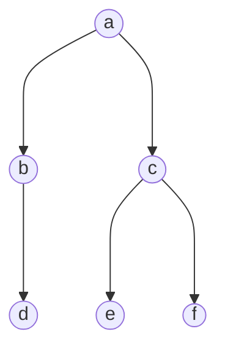
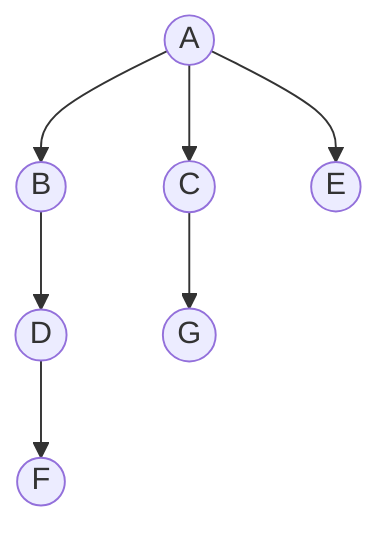

# Assignment 2

## Question 1

### 折半查找

折半查找是在一个有序数组中使用的查找方法。它每次将待查找的键值与数组中间元素的键值进行比较，通过比较可以排除一半的搜索区域，从而大大提高查找效率。

* **最好情况**：待查找的元素正好是数组中间的元素。查找次数为 $1$ 次。
* **平均情况和最坏情况**：在平均和最坏的情况下，查找次数约为 $log_2N$ 次，其中 $N$ 是数组元素的数量。最坏情况是待查找的元素在数组的最末端或未找到元素，需要进行完整的 $log_2N$ 次查找。

### 顺序查找

顺序查找是从数组的第一个元素开始，逐个比较直到找到所需的元素。

* **最好情况**：待查找的元素是数组的第一个元素。查找次数为 $1$ 次。
* **平均情况**：平均查找次数大约是 $N/2$ 次。
* **最坏情况**：待查找的元素是数组的最后一个元素或者不在数组中，查找次数为 $N$ 次。

### 速度比较

$$
\text{加速比}=\frac{\text{顺序查找次数}}{\text{折半查找次数}}
$$

给定 $N = 10000000$：

* **最好情况**：折半查找和顺序查找都是 $1$ 次查找。加速比为 $1$ 倍，即两者性能相同。
* **平均情况**：顺序查找需要大约 $N/2 = 5000000$ 次，折半查找需要 $log_2N = 23.25$ 次。加速比约为 $215054$ 倍，这意味着折半查找在平均情况下比顺序查找快约 $21.5$ 万倍。
* **最坏情况**：顺序查找需要 $N = 10000000$ 次，折半查找需要 $log_2N = 23.25$ 次。加速比约为 $430108$ 倍，这意味着折半查找在最坏情况下比顺序查找快约 $43.0$ 万倍。

## Question 2

### 基础情况

当 $N = 1$ 时：
1. 两个水手过去
1. 一个水手回来
1. 探险家过去
1. 一个水手回来，此时两个水手都在有船的岸边

### 构造自顶向下的递归

```
f(n) = f(n-1) + 4
f(1) = 4
```

```python
def func(n):
    if n == 0:
        return 0
    elif n == 1:
        return 4
    else:
        return func(n - 1) + 4
```

### 构造自底向上的迭代

* 每一次迭代前保证两个水手和船都回到初始位置
* 循环递增士兵的数量
* 当 `迭代次数 > N` 时退出循环

```python
def func(n):
    sum = 0
    while n >= 1:
        sum += 4
        n -= 1
    return sum
```

### 船的横渡次数

这条船要在岸与岸之间横渡 $4N$ 次。

## Question 3



a. **前序遍历顺序**：a, b, d, c, e, f

b. **中序遍历顺序**：d, b, a, e, c, f

c. **后序遍历顺序**：d, b, e, f, c, a

## Question 4

设计一个穷举查找算法以确定给定图 $G$ 是否包含一个大小为 $k$ 的完全子图，首先需要确定图 $G$ 适合的数据结构表示。这里选择用邻接矩阵表示，因为它允许快速检查两个节点之间是否存在边。

使用递归或迭代方法生成图中所有大小为 $k$ 的节点组合。对于每个节点组合，检查组合中的每对节点是否都通过边相连。如果一个组合中的每对节点都直接相连，那么这个组合就是一个完全子图。

```python
import itertools

def has_complete_subgraph(adj_matrix, k):
    n = len(adj_matrix)
    for nodes in itertools.combinations(range(n), k):
        all_connected = True
        for i, j in itertools.combinations(nodes, 2):
            if not adj_matrix[i][j]:
                all_connected = False
                break
        if all_connected:
            return True
    return False

adj_matrix = [
    [0, 1, 0, 1],
    [1, 0, 1, 1],
    [0, 1, 0, 1],
    [1, 1, 1, 0]
]

print(has_complete_subgraph(adj_matrix, 3)) # 输出：True
print(has_complete_subgraph(adj_matrix, 4)) # 输出：False
```

## Question 5

a. 邻接矩阵和邻接链表表示

* **邻接矩阵表示**：

$$
\begin{array}{|c|ccccccc|}
\hline
  & A & B & C & D & E & F & G \\
\hline
A & 0 & 1 & 1 & 1 & 1 & 0 & 0 \\
B & 1 & 0 & 0 & 1 & 0 & 1 & 0 \\
C & 1 & 0 & 0 & 0 & 0 & 0 & 1 \\
D & 1 & 1 & 0 & 0 & 0 & 1 & 0 \\
E & 1 & 0 & 0 & 0 & 0 & 0 & 1 \\
F & 0 & 1 & 0 & 1 & 0 & 0 & 0 \\
G & 0 & 0 & 1 & 0 & 1 & 0 & 0 \\
\hline
\end{array}
$$

* **邻接链表表示**：

  * $A: [B, C, D, E]$
  * $B: [A, D, F]$
  * $C: [A, G]$
  * $D: [A, B, F]$
  * $E: [A, G]$
  * $F: [B, D]$
  * $G: [C, E]$

b. 构造深度优先查找树

在深度优先搜索中，我们使用一个栈来跟踪访问顶点的顺序，并且当我们访问一个顶点时，我们会递归地访问它所有未被访问的相邻顶点。

在深度优先搜索中，我们会跟踪两个主要的列表：

* **访问顺序**（顶点第一次被访问到，即压入遍历栈的顺序）
* **完成顺序**（顶点变为终点，即弹出遍历栈的顺序）

```python
def dfs(graph, start = 'A'):
    visited_order = []
    finish_order = []
    visited = set()
    stack = []

    def dfs_recursive(v):
        visited.add(v)
        visited_order.append(v)
        stack.append(v)
        for neighbor in sorted(graph[v]):
            if neighbor not in visited:
                dfs_recursive(neighbor)
        finish_order.append(v)
        stack.pop()

    dfs_recursive(start)
    return visited_order, finish_order

graph = {
    'A': ['B', 'C', 'D', 'E'],
    'B': ['A', 'D', 'F'],
    'C': ['A', 'G'],
    'D': ['A', 'B', 'F'],
    'E': ['A', 'G'],
    'F': ['B', 'D'],
    'G': ['C', 'E']
}

dfs_visit_order, dfs_finish_order = dfs(graph)
print(dfs_visit_order)
print(dfs_finish_order)
```

深度优先查找树：



* **访问顺序**：A, B, D, F, C, G, E
* **完成顺序**：F, D, B, E, G, C, A

## Question 6

### Solution

编写一个算法实现搜索 $M \times N$ 矩阵 `matrix` 中的一个目标值 `target` 。该矩阵的每一行和每一列都是按升序排列的。矩阵的这种特定排列方式允许使用一种优化的搜索方法，从而实现了 $O(m+n)$ 的时间复杂度，其中 $m$ 是矩阵的行数， $n$ 是矩阵的列数。

解题思路：

* 起点选择：搜索从矩阵的右上角开始。这个起点至关重要，因为它允许算法向目标值 `target` 增加或减少的方向移动。
* 移动逻辑：
  * 如果当前元素等于目标值，搜索成功结束，并返回 `true` 。
  * 如果当前元素小于目标值，这表示该行左边的所有元素也都更小（因为行是升序排列的）。因此，搜索向下移动到下一行（行索引增加）。
  * 如果当前元素大于目标值，这表示该列下面的所有元素也都更大（因为列是升序排列的）。因此，搜索向左移动到前一列（列索引减少）。
* 终止条件：当找到目标或者索引移出矩阵边界时（即行索引超出最后一行或列索引低于零时），搜索终止，并返回 `false` 。

时间复杂度解释：

* 最佳情况：如果目标位于矩阵的右上角，算法只需进行一次比较即可立即找到它。
* 最坏情况：在最坏的情况下，算法可能需要从右上角遍历到左下角。这一遍历路径最多涵盖 $m$ 行和 $n$ 列，总计 $m+n$ 步，这解释了为何时间复杂度是 $O(m+n)$ 。

### Code

```cpp
#include <iostream>
#include <vector>

typedef std::vector<std::vector<int>> Matrix;

class Solution {
public:
    bool search(Matrix& matrix, int target) {
        if (matrix.empty() || matrix[0].empty()) {
            return false;
        }

        int m = matrix.size();
        int n = matrix[0].size();
        int row = 0;
        int col = n - 1;

        while (row < m && col >= 0) {
            if (matrix[row][col] == target) {
                return true;
            }
            else if (matrix[row][col] < target) {
                row++;
            }
            else {
                col--;
            }
        }

        return false;
    }
};

int main()
{
    Solution solution;
    std::cout << std::boolalpha;

    // Test Case 1
    Matrix testCase1 = {{ 5,11,15 },
                        { 6,12,19 },
                        { 7,17,23 }};
    std::cout << solution.search(testCase1, 17) << std::endl;
    std::cout << solution.search(testCase1, 18) << std::endl;

    // Test Case 2
    Matrix testCase2 = {{ 5,11,15,20 },
                        { 6,12,19,24 },
                        { 7,17,23,30 }};
    std::cout << solution.search(testCase2, 30) << std::endl;
    std::cout << solution.search(testCase2, 32) << std::endl;

    // Test Case 3
    Matrix testCase3 = {{ 5,11,15 },
                        { 6,12,19 },
                        { 7,17,23 },
                        { 9,20,30 }};
    std::cout << solution.search(testCase3, 5) << std::endl;
    std::cout << solution.search(testCase3, 2) << std::endl;

    return 0;
}
```