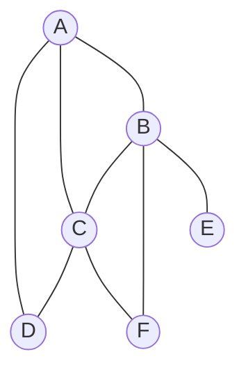
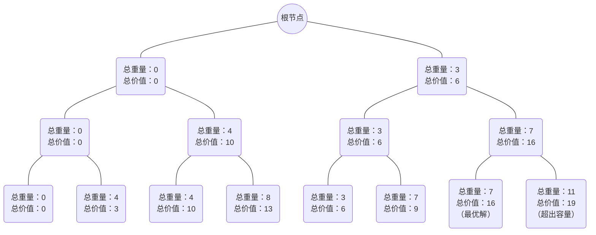
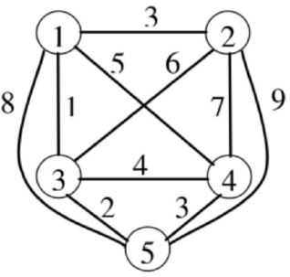
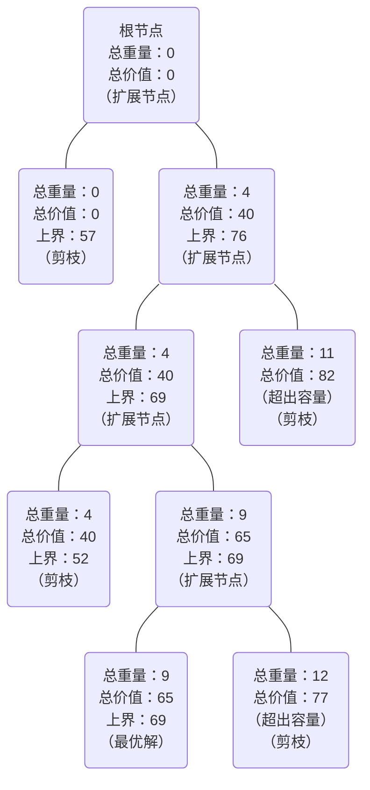

# Assignment 3

## Question 1

为了解决这个问题，我们可以将每门课程视为图中的一个节点，如果有学生同时选修两门课程，则这两门课程之间存在一条边。目标是在图中找到一种节点着色的方式，使得任何相连的节点（即有共同学生的两门课程）不会被安排在连续的天里进行考试。

根据题目中给出的选课信息（DCA，BCF，EB，AB），我们可以构建出如下的无向图：



解题过程：

* 图的表示
  * 定义一个图的邻接表表示。这个邻接表 `graph` 使用字典存储，每个键（课程名称）映射到一个列表，列表中包含与该课程有共同学生的其他课程。
* 安全性检查
  * `is_safe` 函数用来检查给定的颜色（在这道题目中颜色代表一天）是否可以分配给特定的节点（课程）。
  * 确保没有相邻的节点（课程）使用相同的颜色。
  * 确保没有相邻的节点使用相邻的颜色（即日期连续）。
* 图着色算法
  * `graph_coloring` 函数是一个使用回溯法的递归函数，尝试为图中的每个节点分配颜色。它按顺序处理每个节点（在这里是课程），并尝试所有可能的颜色（即六天）。对于每种颜色，它首先使用 `is_safe` 函数检查颜色是否安全：
    * 如果颜色安全，它将颜色分配给节点，并递归地尝试为下一个节点着色。
    * 如果为所有节点成功着色，则返回 `True` 。
    * 如果某种颜色配置失败（即无法为后续节点找到合适的颜色），则取消当前节点的颜色分配（回溯）并尝试下一种颜色。

Python 代码实现如下：

```python
def is_safe(node, color, graph, color_assignment):
    for neighbor in graph[node]:
        neighbor_color = color_assignment[neighbor]
        if neighbor_color is not None:
            if neighbor_color == color or abs(neighbor_color - color) == 1:
                return False
    return True

def graph_coloring(graph, colors, node, color_assignment):
    if node == len(graph):
        return True
    current_node = list(graph.keys())[node]
    for color in colors:
        if is_safe(current_node, color, graph, color_assignment):
            color_assignment[current_node] = color
            if graph_coloring(graph, colors, node + 1, color_assignment):
                return True
            color_assignment[current_node] = None
    return False

graph = {
    'A': ['D', 'C', 'B'],
    'B': ['A', 'C', 'E', 'F'],
    'C': ['A', 'D', 'B', 'F'],
    'D': ['A', 'C'],
    'E': ['B'],
    'F': ['B', 'C']
}
colors = [1, 2, 3, 4, 5, 6]
color_assignment = {node: None for node in graph}

if graph_coloring(graph, colors, 0, color_assignment):
    print('成功分配考试日期:', color_assignment)
else:
    print('无法在6天内安排考试')
```

代码运行结果：

```
成功分配考试日期: {'A': 1, 'B': 3, 'C': 5, 'D': 3, 'E': 1, 'F': 1}
```

即分配考试日期：

* 课程 A 安排在第 1 天考试
* 课程 B 安排在第 3 天考试
* 课程 C 安排在第 5 天考试
* 课程 D 安排在第 3 天考试
* 课程 E 安排在第 1 天考试
* 课程 F 安排在第 1 天考试

## Question 2

对于0/1背包问题，我们可以通过构建一个解空间树来进行解答。解空间树是一种回溯法的体现，它以二叉树的形式来表示所有可能的选择情况（即每个物品要么被选择，要么不被选择）。我们的目标是找出不超过背包容量的所有组合中，价值最高的组合。

解空间树中的每个节点代表一个物品的决策（选择或不选择）。树的每一层对应一个物品的决策，树的深度等于物品的数量。**左子树代表选择该物品，右子树代表不选择该物品。**

树的层级解释：

* 第一层：决策是否选择第一个物品（重量为3，价值为6）
* 第二层：决策是否选择第二个物品（重量为4，价值为10）
* 第三层：决策是否选择第三个物品（重量为4，价值为3）



从以上可行解中，(1, 1, 0) 的组合总重量为7，总价值为16，是所有不超出背包容量的解中价值最高的。因此，**最优解**是选择第一个和第二个物品，**最优值**是16。这样，我们就利用解空间树的方法找到了0/1背包问题的最优解。

Python 代码实现如下：

```python
weights = [3, 4, 4]
values = [6, 10, 3]
capacity = 9
items = 3

best_value = 0
best_combination = []

def backtrack(i, current_weight, current_value, combination):
    global best_value, best_combination

    if i == items or current_weight > capacity:
        if current_value > best_value:
            best_value = current_value
            best_combination = combination[:]
        return

    backtrack(i + 1, current_weight, current_value, combination + [0])

    if current_weight + weights[i] <= capacity:
        backtrack(i + 1, current_weight + weights[i], current_value + values[i], combination + [1])

backtrack(0, 0, 0, [])

print('Best Value:',best_value)
print('Best Combination:', best_combination)
```

代码运行结果：

```
Best Value: 16
Best Combination: [1, 1, 0]
```

## Question 3

分支限界法是一种用于解决旅行商问题（TSP）的有效方法，它利用优先队列来探索所有可能的路径，同时利用下界（最小成本）来剪枝，避免不必要的计算。旅行商问题是要找到一个最短的路径，让旅行商从一个起点出发，访问每个城市一次之后回到起点。

对于给定的图，我们从节点 1 出发，寻找一个访问所有节点并返回起点的最短路径。



解题思路：

* 初始化
  * 创建图与边：首先，使用 `networkx` 创建一个图 `G` ，并添加了节点和边，每条边附带权重，表示两节点之间的距离。
  * 初始化优先队列：使用 Python 的 `heapq` 模块，创建一个优先队列来存储待探索的路径。优先队列中的元素是一个元组，包括当前的总路径成本、当前节点、当前的完整路径和未访问的节点集合。
* 分支限界搜索
  * 循环处理优先队列：通过 `heapq.heappop()` 从优先队列中取出当前成本最低的元素进行处理。
  * 检查未访问节点：如果当前路径已经访问了所有节点，则将路径回到起点，计算总成本，并与已知的最低成本进行比较。如果当前路径的成本更低，就更新最佳路径和最低成本。
  * 扩展节点：对于当前节点的每个未访问的相邻节点，计算经过该节点的总成本。只有当这个新的总成本低于已知的最低成本时，才会将新的路径添加到优先队列中进行进一步的探索。
* 剪枝
  * 在扩展路径时，如果新路径的预估成本已经超过了已知的最低成本，则不再继续探索这条路径，这一操作大大减少了需要考虑的路径数量，优化了算法的效率。
* 结束条件
  * 当优先队列为空时，搜索结束。此时，`best_cost` 和 `best_path` 分别存储着最低的旅行成本和对应的最优路径。

Python 代码实现如下：

```python
import networkx as nx
import heapq

def tsp_branch_and_bound(graph, start_node):
    priority_queue = []
    initial_path = [start_node]
    initial_cost = 0
    unvisited = set(graph.nodes) - set(initial_path)
    heapq.heappush(priority_queue, (initial_cost, start_node, initial_path, unvisited))

    best_cost = float('inf')
    best_path = []

    while priority_queue:
        current_cost, current_node, path, unvisited = heapq.heappop(priority_queue)

        if not unvisited:
            total_cost = current_cost + graph[current_node][start_node]['weight']

            if total_cost < best_cost:
                best_cost = total_cost
                best_path = path + [start_node]
            continue

        for next_node in unvisited:
            next_cost = current_cost + graph[current_node][next_node]['weight']

            if next_cost < best_cost:
                new_unvisited = unvisited - {next_node}
                new_path = path + [next_node]
                heapq.heappush(priority_queue, (next_cost, next_node, new_path, new_unvisited))

    return best_cost, best_path

G = nx.Graph()
edges = [
    (1, 2, 3),
    (1, 3, 1),
    (1, 4, 5),
    (1, 5, 8),
    (2, 3, 6),
    (2, 4, 7),
    (2, 5, 9),
    (3, 4, 4),
    (3, 5, 2),
    (4, 5, 3)
]
for u, v, w in edges:
    G.add_edge(u, v, weight=w)

best_cost, best_path = tsp_branch_and_bound(G, 1)
print("最优成本:", best_cost)
print("最优路径:", best_path)
```

代码运行结果：

```
最优成本: 16
最优路径: [1, 3, 5, 4, 2, 1]
```

## Question 4

分支限界法是一种求解背包问题的有效算法。我们设定背包的最大容量为 $W=10$ ，物品的重量和价值如下所示：

| 物品 | 重量 | 价值 | 单位价值 |
| :---: | :---: | :---: | :---: |
| 1 | 4 | 40 | 10 |
| 2 | 7 | 42 | 6 |
| 3 | 5 | 25 | 5 |
| 4 | 3 | 12 | 4 |

我们的目标是最大化背包中物品的总价值，同时确保总重量不超过背包的容量。

解题思路：

* 初始化
  * 创建物品数组并根据价值进行降序排序。这有助于提高剪枝效率，因为更高单位价值的物品在价值上界计算中优先考虑。
  * 初始化优先队列，并将起始节点（没有包含任何物品，重量和价值均为0）加入队列。
* 节点的扩展
  * 使用一个循环从优先队列中取出当前最有潜力（即价值上界最高）的节点。
  * 检查当前节点是否达到叶节点（处理完所有物品），如果是，更新最优解（如果当前价值超过已知的最大价值）。
* 分支
  * 对每个节点，探索两种可能性：
    * 包含当前物品：只有当包含当前物品后不超过背包容量时，才创建新节点并加入队列。
    * 不包含当前物品：总是创建新节点并加入队列。
  * 对每个新创建的节点，计算其价值上界。如果上界大于已知的最大价值，则将节点加入优先队列。
* 剪枝
  * 在将节点加入队列前，检查其价值上界：
    * 如果节点的价值上界小于或等于已知的最大价值，则放弃该节点，不再进一步探索。
    * 这种剪枝方法帮助减少搜索空间，提高算法效率。
* 计算价值上界（ `bound` 函数）
  * 计算上界时，考虑从当前节点开始，尽可能地填满背包。
  * 首先尝试完全包含后续物品，如果背包容量还有剩余，则尝试部分包含下一个物品，以单位价值作为计算标准。



从以上可行解中，(1, 0, 1, 0) 的组合总重量为9，总价值为65，是所有不超出背包容量的解中价值最高的。因此，**最优解**是选择第一个和第三个物品，**最优值**是65。这样，我们就利用分支限界法和解空间树的方法找到了0/1背包问题的最优解。

Python 代码实现如下：

```python
import heapq

class Node:
    def __init__(self, level, value, weight, bound, items_included):
        self.level = level                    # 当前物品的索引
        self.value = value                    # 当前总价值
        self.weight = weight                  # 当前总重量
        self.bound = bound                    # 价值上界
        self.items_included = items_included  # 已包含物品的记录

def bound(node, n, W, items):
    if node.weight >= W:
        return 0
    value_bound = node.value
    j = node.level + 1
    totweight = node.weight
    while j < n and totweight + items[j][1] <= W:
        totweight += items[j][1]
        value_bound += items[j][0]
        j += 1
    if j < n:
        value_bound += (W - totweight) * items[j][0] / items[j][1]
    return value_bound

def knapsack(items, W):
    items = sorted(items, key=lambda x: x[0]/x[1], reverse=True)
    pq = []
    v = Node(-1, 0, 0, 0.0, [])
    max_value = 0
    max_node = None
    v.bound = bound(v, len(items), W, items)
    heapq.heappush(pq, (-v.bound, v))
    while pq:
        _, v = heapq.heappop(pq)
        if v.bound > max_value:
            u = Node(v.level + 1, v.value, v.weight, 0, v.items_included.copy())
            u.weight += items[u.level][1]
            u.value += items[u.level][0]
            u.items_included.append(1)
            if u.weight <= W and u.value > max_value:
                max_value = u.value
                max_node = u
            u.bound = bound(u, len(items), W, items)
            if u.bound > max_value:
                heapq.heappush(pq, (-u.bound, u))
            u = Node(v.level + 1, v.value, v.weight, 0, v.items_included.copy())
            u.items_included.append(0)
            u.bound = bound(u, len(items), W, items)
            if u.bound > max_value:
                heapq.heappush(pq, (-u.bound, u))
    optimal_solution = [1 if x == 1 else 0 for x in max_node.items_included]
    return max_value, optimal_solution

items = [(40, 4), (42, 7), (25, 5), (12, 3)]
W = 10
optimal_value, optimal_solution = knapsack(items, W)

print('最优值:', optimal_value)
print('最优解:', optimal_solution)
```

代码运行结果：

```
最优值: 65
最优解: [1, 0, 1]
```

## Question 5

零钱兑换问题是背包问题的变种，可以通过动态规划方法解决。

解题思路：

* 初始化动态规划数组和硬币使用列表
  * `dp` 数组用于记录凑出每个金额所需的最少硬币数量，初始化为正无穷大。`dp` 数组的大小为 `amount + 1` ，因为动态规划中的初始状态是从 `0` 开始的， `dp[0]` 设为 `0` ，因为凑出金额为 `0` 时不需要硬币。
  * `coin_used` 列表用于记录达到每个金额所使用的硬币列表，初始化为空列表。
* 状态转移
  * 遍历金额从 `1` 到目标金额 `amount` ，对于每个金额 `i` ，再遍历可用的硬币面额。
  * 如果当前硬币面额小于等于当前金额，并且使用该硬币凑出金额 `i` 的硬币数量比之前的方案更少，则更新 `dp[i]` 和 `coin_used[i]` 。状态转移方程为：$$dp[i]=min(dp[i],dp[i−coin]+1)$$
  * 更新 `dp[i]` 为使用当前硬币凑出金额 `i` 的最少硬币数量，即 `dp[i - coin] + 1` 。
  * 更新 `coin_used[i]` 为使用当前硬币凑出金额 `i` 的硬币列表，即将当前硬币加入凑出金额 `i - coin` 的硬币列表中。
* 返回结果
  * 返回 `dp[amount]` ，即凑出目标金额所需的最少硬币数量。
  * 返回 `coin_used[amount]` ，即凑出目标金额所使用的硬币列表。

`dp` 数组如下：

```python
[0, 1, 2, 3, 4, 1, 2, 3,
 4, 5, 1, 2, 3, 4, 5, 2,
 3, 4, 5, 6, 2, 3, 4, 5,
 6, 3, 4, 5, 6, 7, 3, 4,
 5, 6, 7, 4, 5, 6, 7, 8,
 4, 5, 6, 7, 8, 5, 6, 7,
 8, 9, 1, 2, 3, 4, 5, 2,
 3, 4, 5, 6, 2, 3, 4, 5]
```

Python 代码实现如下：

```python
def minCoins(coins, amount):
    dp = [float('inf')] * (amount + 1)
    dp[0] = 0
    coin_used = [[] for _ in range(amount + 1)]
    for i in range(1, amount + 1):
        for coin in coins:
            if i >= coin and dp[i - coin] + 1 < dp[i]:
                dp[i] = dp[i - coin] + 1
                coin_used[i] = coin_used[i - coin] + [coin]
    return dp[amount], coin_used[amount]

coins = [1, 5, 10, 50]
amount = 63
min_coins, used_coins = minCoins(coins, amount)

print("最少硬币数量:", min_coins)
print("使用的硬币:", used_coins)
```

代码运行结果：

```
最少硬币数量: 5
使用的硬币: [50, 10, 1, 1, 1]
```

## Question 6

### Solution

一个机器人位于一个 $m \times n$ 网格的左上角，机器人每次只能向下或者向右移动一步，机器人试图达到网格的右下角，总共有多少条不同的路径？该问题可使用动态规划法求解。

解题思路：

* 创建一个二维向量 `dp` 用于记录到达每个位置的路径数量。它的大小是 `m` 行 `n` 列，初始化为 `0` 。
* 初始化第一行和第一列的路径数量，因为到达这些位置的路径只有一条。即机器人在第一行或第一列时只能一直向右或向下移动。
* 使用两个嵌套的循环遍历除第一行和第一列之外的所有位置。对于每个位置 `(i, j)` ，我们将其路径数量设为左侧位置 `(i - 1, j)` 的路径数量加上上方位置 `(i, j - 1)` 的路径数量。状态转移方程为：$$dp[i][j]=dp[i-1][j]+dp[i][j-1]$$
* 返回右下角位置 `(m - 1, n - 1)` 的路径数量，即为所求的结果。

### Code

```cpp
#include <iostream>
#include <vector>

class Solution {
public:
    int uniquePaths(int m, int n) {
        std::vector<std::vector<int>> dp(m, std::vector<int>(n, 0));
        for (int i = 0; i < m; i++) {
            dp[i][0] = 1;
        }
        for (int j = 0; j < n; j++) {
            dp[0][j] = 1;
        }
        for (int i = 1; i < m; i++) {
            for (int j = 1; j < n; j++) {
                dp[i][j] = dp[i - 1][j] + dp[i][j - 1];
            }
        }
        return dp[m - 1][n - 1];
    }
};

int main()
{
    Solution solution;

    // Test Case 1
    std::cout << solution.uniquePaths(3, 7) << std::endl;

    // Test Case 2
    std::cout << solution.uniquePaths(3, 2) << std::endl;

    // Test Case 3
    std::cout << solution.uniquePaths(5, 4) << std::endl;

    // Test Case 4
    std::cout << solution.uniquePaths(8, 8) << std::endl;

    // Test Case 5
    std::cout << solution.uniquePaths(4, 8) << std::endl;

    return 0;
}
```