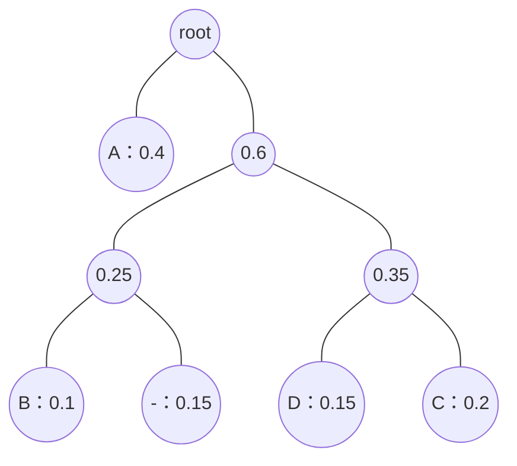

# Assignment 4

## Question 1

> 对由下列邻接矩阵定义的有向图应用 Warshall 算法，求它的传递闭包。
>
> $$
> \begin{bmatrix}
> 0 & 1 & 0 & 0 \\
> 0 & 0 & 1 & 0 \\
> 0 & 0 & 0 & 1 \\
> 0 & 0 & 0 & 0
> \end{bmatrix}
> $$

Warshall算法用于计算有向图的传递闭包。传递闭包是图中所有可达顶点对的集合，即如果存在一条从顶点 $i$ 到顶点 $j$ 的路径，则在传递闭包中 $i$ 到 $j$ 的路径为1。

算法的核心思想是迭代地考虑图中的每一个顶点，看作是潜在的中间点（即路径可以通过此点），从而更新图的可达性信息。具体算法步骤如下：

* 初始化传递闭包矩阵 $T$ 为邻接矩阵 $A$ 。
* 对于每一个顶点 $k$ （从1到 $n$ ），更新矩阵 $T$ 的每一个元素 $T[i][j]$ 。如果 $T[i][k]$ 和 $T[k][j]$ 都为1，则设置 $T[i][j]$ 为1。

初始化传递闭包矩阵 $T$ ：

$$
T=
\begin{bmatrix}
0 & 1 & 0 & 0 \\
0 & 0 & 1 & 0 \\
0 & 0 & 0 & 1 \\
0 & 0 & 0 & 0
\end{bmatrix}
$$

迭代过程：

* 使用顶点1作为中间点：检查通过顶点1能否改进其他路径：无更新，因为1不能到达其他顶点，除了2。
* 使用顶点2作为中间点：更新路径1到3，因为1到2且2到3，所以 $T[1][3]=1$ 。
* 使用顶点3作为中间点：更新路径1到4，因为1到3且3到4，所以 $T[1][4]=1$ ；更新路径2到4，因为2到3且3到4，所以 $T[2][4]=1$ 。
* 使用顶点4作为中间点：无更新，因为4无出度。

最终传递闭包矩阵：

$$
T=
\begin{bmatrix}
0 & 1 & 1 & 1 \\
0 & 0 & 1 & 1 \\
0 & 0 & 0 & 1 \\
0 & 0 & 0 & 0
\end{bmatrix}
$$

## Question 2

> 国际象棋中的车可以水平或竖直移到棋盘中同行或同列的任何一格。将车从棋盘的一角移到另一对角，有多少条最短路径？路径的长度由车所经过的方格数（包括第一格和最后一格）来度量。使用下列方法求解该问题。
>
> * 动态规划算法
> * 基本排列组合

### 动态规划算法

动态规划可以通过构建一个二维数组来计算从起点到任何点的最短路径数量。定义 `dp[i][j]` 为从左下角（假设为坐标（0, 0））到达（i, j）的最短路径数量。

初始化：对于所有的 `i` 和 `j` ，`dp[i][0] = 1` 和 `dp[0][j] = 1` ，因为只有一条直线路径。

递推关系：对于 `i > 0` 和 `j > 0` ，`dp[i][j] = dp[i-1][j] + dp[i][j-1]` ，这是因为从（i, j）这一点可以从上方（i-1, j）或左方（i, j-1）到达。

```python
def nearest_way(n):
    dp = [[0] * n for _ in range(n)]
    for i in range(n):
        dp[i][0] = 1
        dp[0][i] = 1
    for i in range(1, n):
        for j in range(1, n):
            dp[i][j] = dp[i-1][j] + dp[i][j-1]
    return dp[n-1][n-1]

nearest_way(8)
```

代码运行结果：3432

### 基本排列组合

在8x8的棋盘上，从一角到另一角的最短路径需要7步向上和7步向右，共计14步。问题可以转化为在这14步中选择7步作为向上移动的组合问题。

最短路径的数量可以通过组合数计算：

$$
C(14, 7) = \frac{14!}{7! \times (14-7)!} = 3432
$$

## Question 3

> a. 对下面的数据构造一套哈夫曼编码：
>
> | 字符 | A | B | C | D | - |
> | :---: | :---: | :---: | :---: | :---: | :---: |
> | 出现概率 | 0.4 | 0.1 | 0.2 | 0.15 | 0.15 |
>
> b. 用 a 中的编码对文本 ABACABAD 进行编码。
> c. 对于 100010111001010 用 a 中的编码进行解码。

### 构造哈夫曼编码

哈夫曼编码通过将出现频率较低的字符组合成二叉树的叶子节点，并逐步构建到树的顶部，来构造最优的前缀编码。过程如下：

* 列出所有字符及其频率
  * A：0.4
  * B：0.1
  * C：0.2
  * D：0.15
  * -：0.15
* 将频率最低的两个字符合并，构成一个新的节点，其频率为两者之和，然后重新排序
* 重复步骤2，直到构成一个单一的根节点

按照这个方法：

* 合并概率最小的两个节点（B, -），创建一个新的节点，概率为 0.1 + 0.15 = 0.25。
* 重复此过程，合并下一对概率最小的节点（D, C），新节点概率为 0.15 + 0.2 = 0.35。
* 合并新创建的两个节点（0.25 和 0.35），形成一个新的节点，概率为 0.25 + 0.35 = 0.60。
* 最后，合并剩余的两个节点（A 和 0.60），最终得到一个根节点，概率为 0.4 + 0.60 = 1.0。



基于此树，我们可以为每个字符分配一个唯一的哈夫曼编码：

* A：0
* B：100
* C：111
* D：110
* -：101

### 编码 ABACABAD

根据上面的编码，我们可以将每个字符转换为相应的哈夫曼编码：

* A：0
* B：100
* A：0
* C：111
* A：0
* B：100
* A：0
* D：110

所以，文本“ABACABAD”的哈夫曼编码为：0100011101000110

### 解码 100010111001010

根据哈夫曼编码解码：

* 100：B
* 0：A
* 101：-
* 110：D
* 0：A
* 101：-
* 0：A

所以，字符串“100010111001010”解码后为：BA-DA-A

***由于D和-的概率相同，构建哈夫曼树的过程中存在多种可能的组合方式，这会导致不同的哈夫曼编码结果。这种情况下，哈夫曼编码不是唯一的，但无论选择哪种组合方式，都能保持最优的压缩效率。***

## Question 4

> 假设有一个很长的花坛，一部分地块种植了花，另一部分却没有。可是，花不能种植在相邻的地块上，它们会争夺水源，两者都会死去。
>
> 给你一个整数数组 `flower` 表示花坛，由若干 `0` 和 `1` 组成，其中 `0` 表示没种植花， `1` 表示种植了花。另有一个数 `n` ，能否在不打破种植规则的情况下种入 `n` 朵花？能则返回 `true` ，不能则返回 `false` 。

在这个问题中，我们需要决定是否可以在不违反相邻规则的情况下，在花坛中种植 `n` 朵花。花坛由一个整数数组 `flower` 表示，其中 `0` 代表空地块， `1` 代表已种植花的地块。规则是花不能种植在相邻的地块上。

算法思路如下：

* **扩展花坛数组**：为了简化边界条件的处理，我们在 `flower` 数组的开始和结束位置各添加一个 `0` 。这样做的好处是不需要特别处理数组的第一个和最后一个元素，因为我们可以保证边界永远是 `0` ，即没有花。
* **遍历并尝试种植**：从数组的第二个元素（实际上是原始 `flower` 的第一个元素）开始，到倒数第二个元素（实际上是原始 `flower` 的最后一个元素）结束遍历。对于每个元素，检查它和它的前一个及后一个元素。如果当前元素及其相邻元素都是 `0` （即 `flowerbed[i - 1] == 0 && flowerbed[i] == 0 && flowerbed[i + 1] == 0` ），则在当前位置种植一朵花（将 `flowerbed[i]` 设为 `1` ），并将 `n` 减一。
* **检查是否能种完所有花**：遍历完所有可能的种植位置后，如果 `n <= 0` ，意味着我们成功种下了至少 `n` 朵花，返回 `true` ；否则返回 `false` 。

```cpp
#include <iostream>
#include <vector>

class Solution {
public:
    bool canPlaceFlowers(std::vector<int>& flower, int n) {
        flower.insert(flower.begin(), 0);
        flower.push_back(0);
        int len = static_cast<int>(flower.size());
        for (int i = 1; i < len - 1; i++) {
            if (flower[i - 1] == 0 && flower[i] == 0 && flower[i + 1] == 0) {
                flower[i] = 1;
                n--;
            }
        }
        return n <= 0;
    }
};

int main()
{
    Solution solution;
    std::cout << std::boolalpha;

    // Test Case 1
    std::vector<int> testCase1 = { 1,0,0,0,1 };
    std::cout << solution.canPlaceFlowers(testCase1, 1) << std::endl;

    // Test Case 2
    std::vector<int> testCase2 = { 1,0,0,0,1 };
    std::cout << solution.canPlaceFlowers(testCase2, 2) << std::endl;

    // Test Case 3
    std::vector<int> testCase3 = { 1,0,0,0,1,0,0,0 };
    std::cout << solution.canPlaceFlowers(testCase3, 1) << std::endl;

    // Test Case 4
    std::vector<int> testCase4 = { 1,0,0,0,1,0,0,0 };
    std::cout << solution.canPlaceFlowers(testCase4, 2) << std::endl;

    // Test Case 5
    std::vector<int> testCase5 = { 1,0,0,0,1,0,0,0 };
    std::cout << solution.canPlaceFlowers(testCase5, 3) << std::endl;

    return 0;
}
```

## Question 5

> 你有两个有序且数组内元素互不相同的数组 `nums1` 和 `nums2` 。
>
> 一条合法路径定义如下：
>
> * 选择数组 `nums1` 或 `nums2` 开始遍历（从下标0处开始）
> * 从左到右遍历当前数组
> * 如果你遇到了 `nums1` 和 `nums2` 中都存在的值，那么你可以切换路径到另一个数组对应数字处继续遍历（但合法路径中重复数字只会被统计一次）
>
> 得分定义为合法路径中不同数字的和。
>
> 请你返回所有可能合法路径中的最大得分。由于答案可能很大，请你将它对 $10^9+7$ 取余后返回。

这个问题的核心是找到一条从一个数组开始，能通过跳跃到另一个数组中相同值的位置继续路径，最终获取所有不重复数值的和的最大值。这个问题可以通过动态规划的方法来解决。

算法思路如下：

* **定义状态**：定义两个状态 `dp1[i]` 和 `dp2[j]` 。
  * `dp1[i]` 表示从 `nums1` 的开头到下标 `i` 的路径，可以跳到 `nums2` 的某个位置，所能获得的最大分数。
  * `dp2[j]` 表示从 `nums2` 的开头到下标 `j` 的路径，可以跳到 `nums1` 的某个位置，所能获得的最大分数。
* **状态转移**
  * 当 `nums1[i]` 和 `nums2[j]` 不相等时：
    * 如果 `nums1[i] < nums2[j]` ，说明 `nums1[i]` 只能添加到 `dp1[i]` 上，因为 `nums2` 还没有到达能够与 `nums1[i]` 相等的位置。
    * 如果 `nums1[i] > nums2[j]` ，说明 `nums2[j]` 只能添加到 `dp2[j]` 上，因为 `nums1` 还没有到达能够与 `nums2[j]` 相等的位置。
  * 当 `nums1[i] == nums2[j]` 时，说明在这个交点，可以从一个数组跳到另一个数组继续路径：
    * 这时应考虑从 `nums1` 跳到 `nums2` 或从 `nums2` 跳到 `nums1` ，因此 `dp1[i]` 和 `dp2[j]` 应更新为两者之间的最大值加上当前值 `nums1[i]` 或 `nums2[j]` 。
* **初始化**： `dp1[0]` 和 `dp2[0]` 从它们各自的第一个元素开始计算。
* **计算结果**：遍历两个数组，不断更新 `dp1` 和 `dp2` 直到数组结束。因为可能会有元素没被遍历到（一个数组比另一个长），所以最后还需要单独处理剩余的元素。
* **返回结果**：最终结果是 `dp1[n-1]` 和 `dp2[m-1]` 中的最大值，这里 `n` 和 `m` 是 `nums1` 和 `nums2` 的长度。由于结果可能非常大，最终结果需要对 `10^9 + 7` 取余。

```cpp
#include <iostream>
#include <vector>

class Solution {
public:
    int maxSum(std::vector<int>& nums1, std::vector<int>& nums2) {
        int MOD = 1000000007;
        int i = 0, j = 0;
        long dp1 = 0, dp2 = 0;
        int n = static_cast<int>(nums1.size()), m = static_cast<int>(nums2.size());
        while (i < n && j < m) {
            if (nums1[i] < nums2[j]) {
                dp1 += nums1[i++];
            }
            else if (nums1[i] > nums2[j]) {
                dp2 += nums2[j++];
            }
            else {
                long maxDp = std::max(dp1, dp2) + nums1[i];
                dp1 = dp2 = maxDp;
                i++;
                j++;
            }
        }
        while (i < n) {
            dp1 += nums1[i++];
        }
        while (j < m) {
            dp2 += nums2[j++];
        }
        return (int)(std::max(dp1, dp2) % MOD);
    }
};

int main()
{
    Solution solution;
    std::vector<int> nums1, nums2;

    // Test Case 1
    nums1 = { 2,4,5,8,10 };
    nums2 = { 4,6,8,9 };
    std::cout << solution.maxSum(nums1, nums2) << std::endl;

    // Test Case 2
    nums1 = { 1,3,5,7,9 };
    nums2 = { 3,5,100 };
    std::cout << solution.maxSum(nums1, nums2) << std::endl;

    // Test Case 3
    nums1 = { 1,2,3,4,5 };
    nums2 = { 6,7,8,9,10 };
    std::cout << solution.maxSum(nums1, nums2) << std::endl;

    return 0;
}
```