# Course Notes

## Lecture 01 引言

**算法的定义**：在有限时间内，对问题求解的一个清晰的指令序列。算法的每个输入确定了该算法求解问题的一个实例。

**算法的特点**：输入（ $≥0$ ）、输出（ $≥1$ ）、确定性、有穷性、可行性

**相关算法**：

* 欧几里得算法
* 连续整数检测算法
* 质因数分解
* 埃拉托色尼筛选法

## Lecture 02 算法效率分析基础

**算法效率分析框架**：

* 衡量输入大小
* 衡量运行时间的单位
* （算法效率函数的）增长结束
* 最差情况、最佳情况、平均情况

**基本操作**：对总运行时间影响最大的操作。

* 排序：键的比较
* 四则运算：乘除法

效率分析框架忽略了乘法常数，重点关注 $C(n)$ 的增长阶数。

最优情况并不是指规模最小的输入，而是使算法运行得最快的、规模为 $n$ 的输入。

**平均效率**：

$$
T_{\text{avg}}(N) = \sum_{I \in D_N} P(I)T(N, I) = \sum_{I \in D_N} P(I) \sum_{i=1}^{k} t_{i}e_{i}(N, I)
$$

如果当 $n→∞$ 时， $T(n)→∞$ ， $(T(n)-t(n))/T(n)→0$ ，则称 $t(n)$ 为 $T(n)$ （ $n→∞$ ）的渐进状态， $t(n)$ 为该算法（ $n→∞$ ）的渐进复杂度。

**用于比较算法基本运算次数增长顺序的三种符号**：

* $O(g(n))$ ：存在某个正常数和某个非负整数，使得对于所有 $n \geq n_0$ 有 $t(n) \leq c \cdot g(n)$ （低阶或同阶增长）

  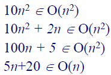

* $Ω(g(n))$ ：存在某个正常数和某个非负整数，使得对于所有 $n \geq n_0$ 有 $t(n) \geq c \cdot g(n)$ （高阶或同阶增长）

  

* $Θ(g(n))$ ：存在某两个正常数和某个非负整数，使得对于所有 $n \geq n_0$ 有 $c_2 \cdot g(n) \leq t(n) \leq c_1 \cdot g(n)$ （同阶增长）

  

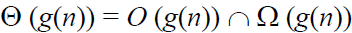

**其他用于比较算法基本运算次数增长顺序的符号**：

* $o(g(n))$ ：存在某个正常数和某个非负整数，使得对于所有 $n \geq n_0$ 有 $t(n) < c \cdot g(n)$ （低阶增长）
* $ω(g(n))$ ：存在某个正常数和某个非负整数，使得对于所有 $n \geq n_0$ 有 $t(n) > c \cdot g(n)$ （高阶增长）

**渐近增长阶数特性（也适用于 $Ω$ 符号和 $Θ$ 符号）**：

* 反身性： $f(n)∈O(f(n))$
* 传递性： $f(n)∈O(g(n)), g(n)∈O(h(n)) ⇒ f(n)∈O(h(n))$
* 互对称性： $f(n)∈O(g(n)) ⇔ g(n)∈Ω(f(n))$
* 对称性： $f(n)∈Θ(g(n)) ⇔ g(n)∈Θ(f(n))$
* 加法计算： $O(g_1(n))+O(g_2(n))=O(g_1(n)+g_2(n))$
* 乘法计算： $O(g_1(n)) \times O(g_2(n))=O(g_1(n) \times g_2(n))$
* 忽略常数： $O(cf(n))=O(f(n))$

对于由两个连续执行的部分组成的算法，算法的整体效率将由增长阶数较大的部分决定。

$$
\lim_{n \to \infty} \frac{T(n)}{g(n)} = 
\begin{cases} 
0, & T(n) \text{的增长阶数} < g(n) \text{的增长阶数（} O \text{符号）} \\
c > 0, & T(n) \text{的增长阶数} = g(n) \text{的增长阶数（} Θ、O、Ω\text{符号）} \\
\infty, & T(n) \text{的增长阶数} > g(n) \text{的增长阶数（} Ω \text{符号）}
\end{cases}
$$

$$
1 < \log n < n < n \log n < n^2 < n^3 < 2^n < 3^n < n! < n^n
$$

**算法的数学分析步骤**：


**非递归算法的数学分析步骤**：

* 确定表示输入大小的参数 $n$
* 确定算法的基本操作
* 检查基本操作的执行次数是否只取决于输入值 $n$ 。如果还取决于输入类型，则分别研究最差、平均和最佳情况下的效率
* 为 $C(n)$ 设置求和，反映算法基本操作的执行次数
* 使用标准公式简化求和，找出封闭式公式，或至少找出其增长顺序

**相关算法**：

* 最大元素问题
* 元素唯一性问题
* 矩阵乘法问题
* 计算二进制数位数问题

**递归算法的数学分析步骤**：

* 确定表示输入大小的参数 $n$
* 确定算法的基本操作
* 检查基本操作的执行次数是否会因相同大小的不同输入而变化，如果会则分别研究最差、平均和最佳情况下的效率
* 为 $C(n)$ 设置递推关系和初始条件，即对大小为 $n$ 的输入执行基本操作的次数（也可计算递推调用次数）
* 通过反向替换法或其他方法解决递推问题或估计解的增长顺序

**相关算法**：

* 递归方式计算阶乘问题
  * 递归条件： $M(n)=M(n-1)+1$
  * 初始条件： $M(0)=0$
  * 反向替换法： $M(n)=n$
* 汉诺塔问题
  * 递归条件： $M(n)=2M(n-1)+1$
  * 初始条件： $M(1)=1$
  * 反向替换法： $M(n)=2^n-1$
* 计算二进制数位数问题
  * 递归条件： $M(n)=M(\lfloor n/2 \rfloor)+1$
  * 初始条件： $M(1)=0$
  * 反向替换法： $M(2^k)=k ⇒ M(n)= \log _2n$
* 斐波那契数列问题
  * 递归条件： $F(n)=F(n-1)+F(n-2)$
  * 初始条件： $F(0)=0$，$F(1)=1$
* 斐波那契螺旋问题

  

* 兔子问题
  * 递归条件： $F(n)=F(n-1)+F(n-2)$
  * 初始条件： $F(0)=1$，$F(1)=1$
* 树枝生长问题（鲁德维格定律）
  一株树苗在一段间隔，例如一年，以后长出一条新枝；第二年新枝“休息”，老枝依旧萌发；此后，老枝与“休息”过一年的枝同时萌发，当年生的新枝则次年“休息”。这样，一株树木各个年份的枝桠数，便构成斐波那契数列。

  

* 上楼梯问题

  

* 蜜蜂进蜂房问题

  

## Lecture 03 蛮力法

**相关算法**：

* 计算 $a^n$
* 计算 $n!$
* 连续整数检测算法
* 查找算法
* 矩阵相乘算法

**排序问题**：

* 选择排序
  * 基本操作：比较
  * 比较次数： $n(n-1)/2$
  * 交换次数： $n-1$
  * 该算法不需要考虑最差、平均和最优效率
* 冒泡排序
  * 基本操作：比较
  * 比较次数： $n(n-1)/2$
  * 交换次数： $n(n-1)/2$
  * 对于所有规模为 $n$ 的数组，该算法的键值比较次数相同
  * 最坏的情况是遇到一个降序排列的数组，此时键比较和键交换的次数相同
  * 如果列表中没有交换，则说明列表已经排序，我们可以停止算法

**查找问题**：

* 顺序查找
* 字符串匹配

**蛮力法解决组合问题的步骤**：

* 列出所有解决方案
* 选择满足条件的解决方案
* 逐一评估，排除不可行的解决方案，跟踪找到的最佳解决方案
* 找到的理想解决方案

通过图中所有顶点一次且仅一次的通路称为哈密顿通路。通过图中所有顶点一次且仅一次的回路称为哈密顿回路。具有哈密顿回路的图称为哈密顿图。

**相关算法**：

* 旅行商问题（TSP）：找到最短的哈密顿回路
  * 排列数量： $(n-1)!$
* 背包问题
  * 排列数量： $2^n$
* 任务分配问题
  * 排列数量： $n!$

**NP 难问题**：没有已知的多项式时间解法。
  * 旅行商问题（TSP）
  * 背包问题
  * 任务分配问题

**深度优先搜索（DFS）**：

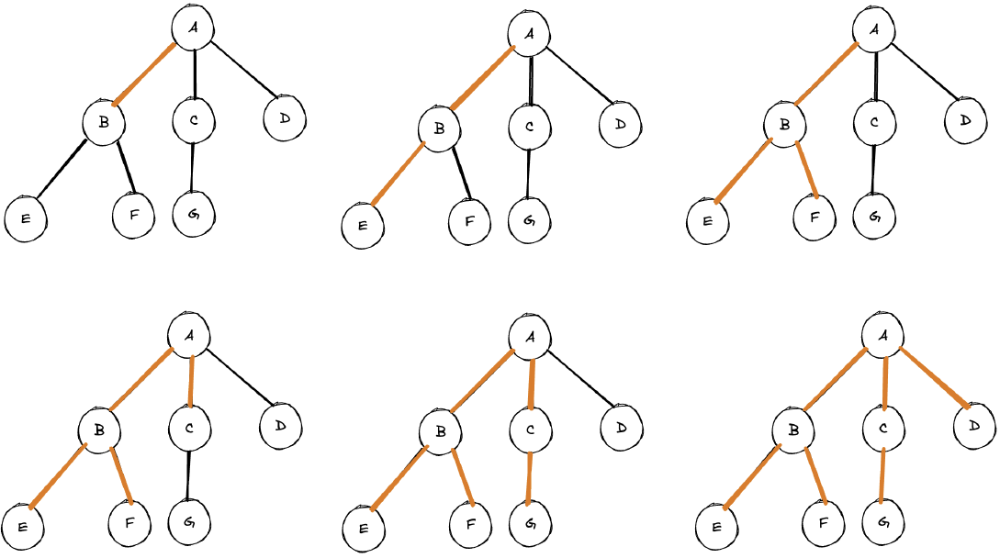

**广度优先搜索（BFS）**：


## Lecture 04 递归法

**递归法**：递归的边界条件和递归方程是递归的两个要点。

递归的简单形式汇掩盖递归的非高效性。

**相关算法**：

* 递归方式计算阶乘

  

* 递归方式计算斐波那契数列

  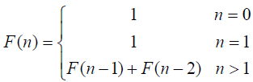

  斐波那契数列的一个封闭形式解（Binet 公式）：

  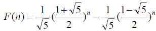

  

  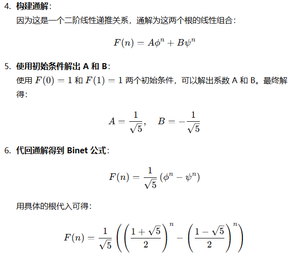

* 阿克曼（Ackerman）函数
  * $A(n,0)=n+2$
  * $A(n,1)=2n$
  * $A(n,2)=2^n$

  

* 汉诺塔问题
* 排列问题：先固定第一个元素，求剩下的全排列，求剩下的全排列时，固定剩余元素中的第一个元素，再求剩下元素的全排列，直到就剩一个元素停止
  * 复杂度： $n!$

  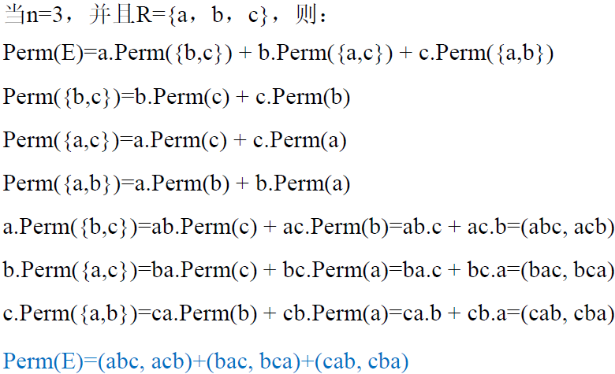

## Lecture 05 减治法

**减治法**：自顶向下（递归）与自底向上（迭代）

**减治法的三种变体**：

* 减常量

  

* 减常因子

  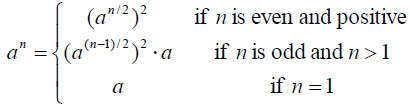

  

* 减可变规模

  

**减一算法**：

* 插入排序：

  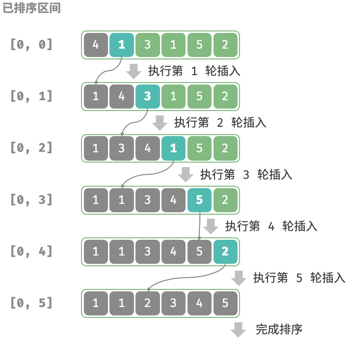

  * 基本操作：比较
  * 最差情况： $n(n-1)/2$
  * 最佳情况： $n-1$
  * 平均情况： $≈n^2/4$

  在使用快速排序时，当子数组小于某个值之后，就可以改用插入排序。

* 拓扑排序：有向无环图（DAG）是拓扑排序的充分必要条件

  * 先修课程问题
    * 深度优先查找（DFS）
      * DFS 遍历注意顶点从堆栈中弹出的顺序
      * 颠倒上述顺序
      * DFS 遍历顺序与拓扑排序顺序相反
      * 复杂度分析：$O(E+V)$ （邻接链表）
    * 基于减治技术（Source Removal Method）
      * 复杂度分析：$O(E+V)$ （邻接链表）

      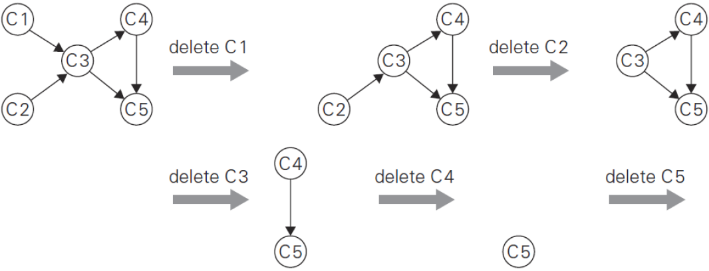

  * 生物链问题
  * 程序编译中的指令调度问题
  * 电子表格单元格的公式求值顺序问题
  * 链接器中的符号依赖问题

**减一算法时间效率分析**：

递推方程的一般形式： $T(n)=T(n-1)+f(n)$

$f(n)$ 表示把一个实例化简为一个更小的实例并把更小实例的解拓展为更大实例的解所需要的时间。

使用反向替换法求解，得到：

$$
T(n) = T(0) + \sum_{j=1}^{n} f(j)
$$

**减常因子算法**：

* 二分搜索
  * 最差情况： $\log _2n+1$
  * 最佳情况： $1$
  * 平均情况： $\log _2(n+1)-1$
* 假硬币问题
  * 二分方式
    * 递归条件： $W(n)=W(\lfloor n/2 \rfloor)+1$
    * 初始条件： $W(1)=0$
    * 时间复杂度： $W(n)=O(\log _2n)$
  * 三分方式
    * 递归条件： $W(n)=W(\lfloor n/3 \rfloor)+1$
    * 初始条件： $W(1)=0$
    * 时间复杂度： $W(n)=O(\log _3n)$
* 俄氏乘法

  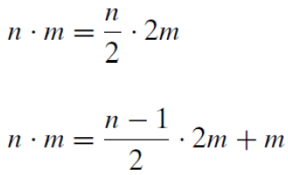

  使用俄氏乘法计算 $50 \times 65$ ：

  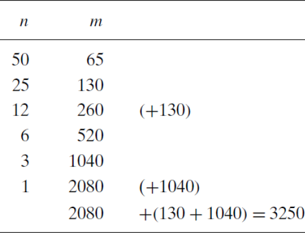

**减常因子算法时间效率分析**：

递推方程的一般形式： $T(n)=T(n/b)+f(n)$ （ $b>1$ ）

$f(n)$ 表示把一个实例化简为一个更小的实例并把更小实例的解拓展为更大实例的解所需要的时间。

基于平滑法则，使用反向替换法求解，得到：

$$
T(b^k) = T(1) + \sum_{j=1}^{k} f(b^j)
$$

## Lecture 06 分治法

**分治法步骤**：

* 将问题分成两个或多个更小的子问题
* 通过递归解法解决子问题
* 将子问题的解决方案合并为原始问题的解决方案

**合并排序**：按照元素的位置进行划分


* 关键操作：比较
* 递推关系式：
  * 递推条件： $C(n)=2C(n/2)+C_{merge}(n)$
  * 初始条件： $C(1)=0$
* 最坏情况： $C_{merge}(n)=n-1$
* 递推关系式（最坏情况）：
  * 递推条件： $C(n)=2C(n/2)+n-1$
  * 初始条件： $C(1)=0$
* 时间复杂度： $C_{worst}(n)=Θ(n \log n)$

**通用递推关系式**：

* 假设 $n$ 是 $b$ 的幂次，那么大小为 $n$ 的实例可以被分成大小为 $n/b$ 的实例，其中， $a$ 是需要解决的问题的数量
* 运行时间 $T(n)$ 的递推规律如下：

$$
T(n)=aT(n/b)+f(n)
$$

  其中， $f(n)$ 是一个函数，用于计算将问题分割成更小的问题并梳理其解决方案所花费的时间。

**主定理**：

得到通用递推关系式 $T(n)=aT(n/b)+f(n)$ 后，可利用主定理直接求增长次数（仅仅得到增长次数，乘法常量未知；利用初始条件，解递推关系可得精确解）

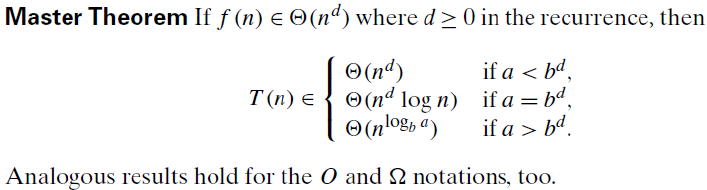

合并排序的递推关系式： $T(n)=2T(n/2)+n-1$

**二分查找**：


**快速排序**：基于划分（按照元素的值）的排序方法

* 基本操作：比较（根据分区是否平衡）
* 分区的比较次数：
  * 指针交叉： $n+1$
  * 指针相等： $n$
* 最佳情况：所有分裂点位于子数组的中点
  * 递推关系： $C_{best}(n)=2C_{best}(n/2)+n$
  * 初始条件： $C_{best}(1)=0$
  * 利用主定理，可得： $C_{best}(n)∈Θ(n \log n)$
* 最差情况：所有分裂点趋于极端，两个子数组一个为空，另一个仅仅比被划分的数组少一个元素
  * 比较次数： $C_{worst}=(n+1)+n+ \dots + 3=(n+1)(n+2)/2-3∈Θ(n^2)$
* 平均情况：分裂点出现在任意位置，左右数组大小分别为 $s$ 和 $n-1-s$ ，分裂点位于每个位置的概率为 $1/n$
  * 比较次数：

    

    $C_{avg}(n)≈2n \ln n≈1.39n \log n∈O(n \log n)$


快速排序在平均情况下，比较操作只比最佳情况多 $39 \%$ ，而且其最内层循环效率高，在处理随机数组时速度比合并排序快。

**算法特性**：

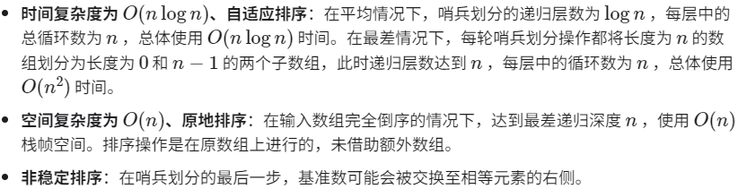

**基准数优化**：

快速排序在某些输入下的时间效率可能降低。举一个极端例子，假设输入数组是完全倒序的，由于我们选择最左端元素作为基准数，那么在哨兵划分完成后，基准数被交换至数组最右端，导致左子数组长度为 $n-1$ 、右子数组长度为 $0$ 。如此递归下去，每轮哨兵划分后都有一个子数组的长度为 $0$ ，分治策略失效，快速排序退化为“冒泡排序”的近似形式。

为了尽量避免这种情况发生，我们可以优化哨兵划分中的基准数的选取策略。例如，我们可以随机选取一个元素作为基准数。然而，如果运气不佳，每次都选到不理想的基准数，效率仍然不尽如人意。

需要注意的是，编程语言通常生成的是“伪随机数”。如果我们针对伪随机数序列构建一个特定的测试样例，那么快速排序的效率仍然可能劣化。

为了进一步改进，我们可以在数组中选取三个候选元素（通常为数组的首、尾、中点元素），并将这三个候选元素的中位数作为基准数。这样一来，基准数“既不太小也不太大”的概率将大幅提升。当然，我们还可以选取更多候选元素，以进一步提高算法的稳健性。采用这种方法后，时间复杂度劣化至 $O(n^2)$ 的概率大大降低。

**大整数乘法（第一个分治算法）**：

* 大整数乘法思路：
  * 先将大整数进行分解

    

    例如：

    

  * 然后再求分解式的乘积

    
* 基本操作：一位整数乘法
* 递推关系式：

  

* 根据主定理，得到： $T(n)=O(n^2)$ （没有提升）

**大整数乘法（第二个分治算法）**：将乘法次数从 $4$ 次减少到 $3$ 次

* $X \times Y = ac \cdot 10^n + (ad + bc) 10^{\lfloor n/2 \rfloor} + bd$
* 因为 $(a + b)(c + d)=ac + (ad + bc) + bd$
* 所以 $X \times Y = ac \cdot 10^n + ((a + b)(c + d) - ac - bd) 10^{\lfloor n/2 \rfloor} + bd$

只需进行 $3$ 次乘法运算，但需要 $3$ 次额外的加法 / 减法运算。

* 递推关系式与复杂度（通过主定理）：

  

**蛮力法解决矩阵乘法**：


**斯特拉森（Strassen）矩阵乘法**：


* 递推关系式与复杂度（通过主定理）：

  

* 如果 $n$ 不是 $2$ 的幂，矩阵可以填充零。
* 斯特拉森（Strassen）矩阵乘法的实际应用通常会在矩阵大小小于某个“交叉点”后切换到蛮力法。

**棋盘覆盖问题**：

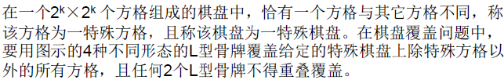


第一次分割：


第二次分割：


第三次分割：


第四次分割：分割为 $1 \times 1$ 棋盘


复杂度分析：


渐进意义下的最优算法： $T(n)=O(4^k)$

所需骨牌个数： $(4^k-1)/3$

**思考题一**：

> 设 `a[0, n-1]` 是一个已经排好序的数组。设计一个搜索算法，使得当搜索元素 `x` 在数组中时， `i` 和 `j` 相同，均为 `x` 在数组中的位置；当搜索元素 `x` 不在数组中时，返回小于 `x` 的最大元素的位置 `i` 和大于 `x` 的最小元素位置 `j` 。

```python
def binary_search_bounds(arr, x):
    left, right = 0, len(arr) - 1
    while left <= right:
        mid = (left + right) // 2
        if arr[mid] == x:
            return mid, mid
        elif arr[mid] < x:
            left = mid + 1
        else:
            right = mid - 1
    return right, left
```

**思考题二**：

> 给定两个大整数 $u$ 和 $v$ ，分别具有 $m$ 位和 $n$ 位数字，且 $m \leq n$ 。使用常规的乘法算法求解 $uv$ 的乘积需要 $O(mn)$ 的时间复杂度。当 $m$ 明显小于 $n$ 时，设计一个算法，在上述情况下用时间复杂度 $O(nm^{\log _2 1.5})$ 求解 $uv$ 的乘积。

为了解决给定的问题，我们可以借助经典的卡拉楚巴（Karatsuba）算法。卡拉楚巴算法基于分治策略，通过将大数字的乘法问题分解成更小的子问题来降低时间复杂度。标准的卡拉楚巴算法可以将两个 $n$ 位数字的乘法时间复杂度从 $O(n^2)$ 降低到 $O(n^{\log _23}) ≈ O(n^{1.585})$ 。

在这里，我们需要解决的问题是 $u$ 和 $v$ 的位数不同，其中 $u$ 的位数 $m$ 明显小于 $v$ 的位数 $n$。我们可以将 $v$ 分成长度为 $m$ 的多个部分，并使用分治法和卡拉楚巴算法来解决这个问题。具体步骤如下：

1. 将 $v$ 分段：
   将 $v$ 分解为长度约为 $m$ 的若干部分，例如：如果 $v$ 是一个 $n$ 位数，我们可以将其分为 $\lceil n/m \rceil$ 个部分，每部分最多 $m$ 位。具体地，设 $v = v_0 + v_1 \cdot 10^m + v_2 \cdot 10^{2m} + \ldots + v_k \cdot 10^{km}$ ，其中每个 $v_i$ （对于 $i < k$ ）都是一个 $m$ 位数，而 $v_k$ 可能少于 $m$ 位。
2. 对每个分段使用卡拉楚巴乘法：
   对于每个分段 $v_i$，使用卡拉楚巴算法计算 $u \cdot v_i$。由于 $u$ 和 $v_i$ 都是 $m$ 位数，这个乘法的复杂度是 $O(m^{\log_2 3})$ 。
3. 合并结果：
   最后，将所有的乘积结果合并，即将 $u \cdot v_i \cdot 10^{im}$ 相加，从 $i = 0$ 到 $k$ 。

整体时间复杂度的计算如下：

* 有 $\lceil n/m \rceil$ 个部分 $v_i$ 。
* 每个部分乘法的时间复杂度是 $O(m^{\log_2 3})$ 。
* 因此，整体乘法的时间复杂度为 $O((n/m) \cdot m^{\log_2 3}) = O(nm^{\log_2 3 - 1}) = O(nm^{\log_2 1.5}) = O(nm^{0.585})$ 。

## Lecture 07 变治法

变治法是一种基于变换思想，把问题变换成一种更容易解决的类型。

**变治的三种变体**：

* 实例化简
  * 预排序
  * 高斯消去法
* 改变表现
  * 堆和堆排序
  * 霍纳法则
* 问题化简
  * 线性规划
  * 整数线性规划

**实例化简——预排序**：

```python
def presort_element_uniqueness(arr):
    arr.sort()
    n = len(arr)
    for i in range(n - 1):
        if arr[i] == arr[i + 1]:
            return True
    return False
```

**常见排序算法的时间效率**：

* 选择排序： $Θ(n^2)$
* 冒泡排序： $Θ(n^2)$
* 插入排序：
  * 最差情况： $Θ(n^2)$
  * 最佳情况： $Θ(n)$
  * 平均情况： $Θ(n^2)$
* 合并排序： $Θ(n \log n)$
* 快速排序：
  * 最差情况： $Θ(n^2)$
  * 最佳情况： $Θ(n \log n)$
  * 平均情况： $O(n \log n)$

没有一种基于比较的普通算法，在最坏情况下的效率能够超过 $n \log n$ ，平均效率也是。

**计算众数**：

蛮力法： $Θ(n^2)$

```python
def find_mode_brute_force(numbers):
    frequency_list = []

    for number in numbers:
        found = False
        for item in frequency_list:
            if item[0] == number:
                item[1] += 1
                found = True
                break
        if not found:
            frequency_list.append([number, 1])

    max_frequency = 0
    mode = None

    for value, frequency in frequency_list:
        if frequency > max_frequency:
            max_frequency = frequency
            mode = value

    return mode
```

预排序法： $Θ(n \log n)$

```python
def find_mode_with_presorting(numbers):
    numbers.sort()

    max_frequency = 1
    current_frequency = 1
    mode = numbers[0]

    for i in range(1, len(numbers)):
        if numbers[i] == numbers[i - 1]:
            current_frequency += 1
        else:
            if current_frequency > max_frequency:
                max_frequency = current_frequency
                mode = numbers[i - 1]
            current_frequency = 1

    if current_frequency > max_frequency:
        mode = numbers[-1]

    return mode
```

**在列表中查找元素**：

蛮力法（顺序查找）： $O(n)$

预排序法： $Θ(n \log n)$

排序列表所带来的好处应该足以弥补排序所花费的时间。

**实例化简——高斯消去法**：

高斯消去法（Gaussian Elimination）是一种用于解线性方程组、计算矩阵的逆或者计算行列式值的算法。其基本思想是通过行变换将系统的系数矩阵转换成一个上三角形矩阵（所有非零元素位于对角线及其以上位置），进而简化问题的求解过程。这种方法得名于数学家卡尔·弗里德里希·高斯，是解决线性方程组中最常用的算法之一。


转换为：


**前向消去**：


**改进后的前向消去**：


**时间效率**：

* 最内层循环：

  

* 基本操作：乘法

  

**回代**：


**时间复杂度**：

$Θ(n^3)+Θ(n^2)=Θ(n^3)$

**一些讨论点**：

* 高斯消去法可以为线性方程组提供一个精确的解，前提是该系统有一个唯一的解。
* 或者，它可以发现没有这样的解存在；在这种情况下，该系统将没有解或有无限多个解。
* 主要的困难在于防止舍入误差的累积。

**高斯消去的应用**：

* LU 分解：通过高斯消去法将矩阵分解为一个下三角矩阵（L）和一个上三角矩阵（U）。这种分解对于解线性方程组和其他矩阵运算非常有用。
* 计算矩阵的逆：可以利用高斯消去法对矩阵进行行变换，直到原矩阵变为单位矩阵，同时应用同样的行变换到单位矩阵上，最终将其转换为原矩阵的逆。
* 计算行列式：通过将矩阵转换为上三角形式，行列式的值即为对角线元素的乘积。

**改变表现——堆和堆排序**：

堆的概念：

* 堆是一个每个节点分配了一个键值的二叉树，每个节点有一个键。
* 形状要求：二叉树必须是基本完整的，即除了最后一层外，其他所有层都是满的，在最后一层可能只缺少一些最右边的叶子。
* 父节点优势要求：对于最大堆，每个节点的键值需大于或等于其子节点的键值。
* 堆的元素是自上而下有序的（从根节点向下的任何路径上的序列是递减的，或者在允许键值相同的情况下是非递增的），但它们并不是从左到右有序的。

最大堆：除根节点外的每个节点，其父节点的键值都大于或等于该节点的键值。

最小堆：除根节点外的每个节点，其父节点的键值都小于或等于该节点的键值。

使用数组来实现堆更为高效，可以按照从上到下、从左到右的顺序存储堆的元素。

* 父节点位于数组的前 $\lfloor n/2 \rfloor$ 个位置。
* 叶节点的键值占据数组的最后 $\lceil n/2 \rceil$ 个位置。


父节点和子节点之间的索引关系：

* 数组中父节点位置为 $i$ 的元素（其中 $i \leq \lfloor n/2 \rfloor$ ），其子节点将位于位置 $2i$ 和 $2i+1$ 。
* 同样地，位于位置 $i$ 的元素（其中 $i > 1$ ），其父节点将位于位置 $\lfloor i/2 \rfloor$ 。

**自底向上构建（Bottom-up Construction）**：

自底向上的堆构建方法首先将所有元素按顺序放入堆中，形成一个完全二叉树（不一定满足堆的性质）。然后从最后一个非叶子节点开始，逐步向根节点进行调整，以确保每个子树都满足最大堆或最小堆的性质。这个过程被称为“向下筛选”（sift-down）。


时间复杂度： $O(n)$

* 每个节点需要进行的比较和可能的交换次数与其在树中的深度（距离根节点的距离）有关。根节点的深度为 $0$ ，最深的节点（叶节点）的深度为 $\lfloor \log _2n \rfloor$ 。 
* 深度较浅的节点较少，但每个需要更多的比较 / 交换步骤；深度较深的节点较多，但每个节点的比较 / 交换步骤较少。
* 对于每一层的节点，向下筛选的复杂度大约为该层节点深度的常数倍。由于树的底部层有更多的节点，这些层的总操作次数对整体复杂度的贡献较大。


**自顶向下构建（Top-down Construction）**：

自顶向下的堆构建方法通过逐个插入元素来构建堆。每次插入都是将新元素添加到堆的末尾，然后通过“向上筛选”（sift-up）过程调整，确保整个堆维持其性质。


时间复杂度： $O(\log n)$

* 每次插入的复杂度主要取决于插入节点与根节点之间的距离，最多不会超过堆的高度 $\lfloor \log _2n \rfloor$ 。
* 因为每次插入操作只涉及从叶子到根的一条路径，所以每次操作的时间复杂度为 $O(\log n)$ 。

自底向上方法通过一次性调整整个非排序数组来建立堆结构，整体效率为 $O(n)$ ，适用于已知全部元素时的堆构建。自顶向下方法通过逐个插入并调整来构建堆，适用于动态数据集，每次插入的效率为 $O(\log n)$ 。

**根节点删除（Root Deletion）**：


时间复杂度： $O(\log n)$

* 在删除过程中，键值比较的次数不会超过堆高度的两倍。
* 在当前节点的两个子节点中选择键值较大的一个。这需要一次比较。
* 比较当前节点与选定的较大子节点的键值，以确定是否需要进行交换。这也是一次比较。

**堆排序**：

堆排序是一种基于堆数据结构实现的高效排序算法。可以利用已经学过的“建堆操作”和“元素出堆操作”实现堆排序。

* 输入数组并建立小顶堆，此时最小元素位于堆顶。
* 不断执行出堆操作，依次记录出堆元素，即可得到从小到大排序的序列。

以上方法虽然可行，但需要借助一个额外数组来保存弹出的元素，比较浪费空间。在实际中通常使用一种更加优雅的实现方式。

算法流程：


算法特性：


**改变表现——霍纳法则**:

蛮力法计算多项式：

```python
def brute_force_polynomial_evaluation(coefficients, x):
    n = len(coefficients) - 1
    p = 0
    for i in range(n, -1, -1):
        power = 1
        for j in range(1, i + 1):
            power *= x
        p += coefficients[i] * power
    return p
```

霍纳法则：将多项式重写为嵌套形式（ $n$ 次乘法和 $n$ 次加法）


```python
def horner_method(coefficients, x):
    result = 0
    # 从最高次项系数开始向下计算
    for i in range(len(coefficients)-1, -1, -1):
        result = result * x + coefficients[i]
    return result
```

**问题化简**：

要解决一个问题，就需要将它化简为另一个你知道如何解决的问题。这涉及到两个要点：

* 找到一个可以化简为当前问题的问题。
* 使用基于化简的算法要比直接解决原始问题更有效。
* 例：把关于三个点的相对位置的几何问题转化成关于行列式符号的问题。

**问题化简——线性规划**：

线性规划算法：

* 单纯形方法：最坏情况下的效率是指数级的
* 椭圆体算法：多项式时间
* 内点法：多项式时间
* 卡马卡尔算法：多项式最坏情况效率

整数线性规划：线性规划问题中的变量需要是整数

* 0-1 背包问题
* 没有已知的多项式时间算法（NP 难问题）
* 分支界限法用于解决整数线性规划问题

相关算法：

* 投资问题
* 0-1 背包问题（离散 / 连续）
* 化简到图
  * 许多问题可以通过化简为标准图问题来解决
  * 状态空间图：图的顶点表示问题的可能状态，边表示这些状态之间允许的转换
  * 图的一个顶点表示初始状态，另一个顶点表示问题的目标状态

**狼、山羊和卷心菜的谜题**：

问题描述：

* 一个农夫必须用一条船将狼、山羊和一袋卷心菜从河的一边运到另一边
* 船只能容纳农夫和另外一件物品
* 约束条件是狼不能单独和山羊呆在一起，山羊不能单独和卷心菜呆在一起

问题解法：


## Lecture 08 回溯法和分支界限法

**穷举搜索**：

* 以系统的方式生成问题的所有潜在解决方案列表
* 选择满足所有约束条件的解决方案
* 逐一评估潜在的解决方案，排除不可行的方案，并且在优化问题中，记录到目前为止找到的最佳解决方案
* 当搜索结束时，宣布找到的所需解决方案
* 通常需要生成特定的组合对象

**DFS（深度优先遍历）**：

```
DFS(G) // 使用深度优先搜索访问图 G=(V, E)，可能包含多个连通分量
    count ← 0 // 访问序列
    // 标记每个顶点为 0（未访问）
    for each vertex v ∈ V do
        if v is marked with 0 // v 尚未被访问
            dfs(v)

dfs(v) // 使用深度优先搜索访问从顶点 v 开始的连通分量
    // 访问顶点 v
    count ← count + 1
    mark v with count
    for each vertex w adjacent to v do
        if w is marked with 0 // w 尚未被访问
            dfs(w)
```

应用：

* 检查图的连通性
* 检查图的无环性
* 寻找有向图的强连通分量
* 寻找无向图的割点
* 对有向图进行拓扑排序
* 边的分类
* 验证无向图是否连通

**BFS（广度优先遍历）**：

```
BFS(G)
    count ← 0
    // 标记每个顶点为 0（未访问）
    for each vertex v ∈ V do
        if v is marked with 0  // 如果 v 还未被访问
            bfs(v)

bfs(v)
    count ← count + 1
    mark v with count // 访问 v
    initialize queue with v // 将 v 入队
    while queue is not empty do
        a ← front of queue // 出队
        for each vertex w adjacent to a do
            if w is marked with 0 // 如果 w 还未被访问
                count ← count + 1
                mark w with count // 访问 w
                add w to the end of the queue // 将 w 入队
        remove a from the front of the queue // 从队列前端移除 a
```

应用：

* 检查图的连通性
* 检查图的无环性
* 寻找两个给定顶点之间边数最少的路径

**回溯法**：

* 系统性：它在包含问题的所有解的解空间树中，按照深度优先的策略，结从根结点出发搜索解空间树。
* 跳跃性：算法搜索至解空间树的任一结时点时，判断该结点为根的子树是否包含问题的解，如果肯定不包含，则跳过以该结点为根的子树的搜索，逐层向其祖先结点回溯。否则，进入该子树，继续深度优先的策略进行搜索。

基本步骤：

* 针对所给问题，定义问题的解空间
* 确定易于搜索的解空间结构
* 以深度优先方式搜索解空间，并在搜索过程中用剪枝函数避免无效搜索

常用剪枝函数：

* 用约束函数在扩展结点处减去不满足约束的子树
* 用限界函数减去得不到最优解的子树

两类常见的解空间树：

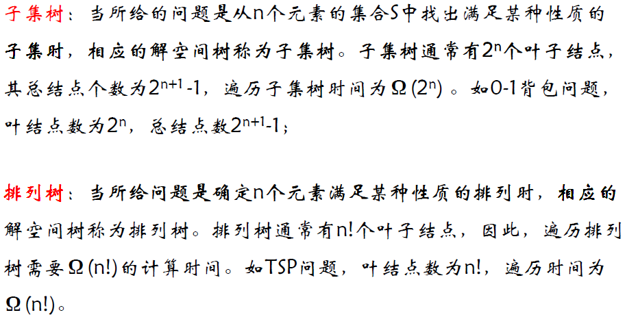

用回溯法解题的一个显著特征是在搜索过程中动态产生问题的解空间。在任何时刻，算法只保存从根结点到当前扩展结点的路径。如果解空间树中从根结点到叶结点的最长路径的长度为 $h(n)$ ，则回溯法所需的计算空间通常为 $O(h(n))$ 。而显式地存储整个解空间则需要 $O(2^{h(n)})$ 或 $O(h(n)!)$ 内存空间。

**子集树回溯算法**：

```
Backtrack(int t) // 搜索到树的第 t 层
{
    // 由第 t 层向第 t + 1 层扩展，确定 x[t] 的值
    if (t > n) then
        output(x) // 叶子结点是可行解
    else
        for each Xt in all possible values of x[t] do // 遍历 x[t] 的所有可能取值集合
            x[t] = Xt // 将 x[t] 设为 Xt 中的一个值
            // 检查约束和限制条件
            if (Constraint(t) and Bound(t)) then
                Backtrack(t + 1) // 如果满足约束和限制条件，则进入下一层
}
```

**排列树回溯算法**：

```
Backtrack(int t) // 搜索到树的第t层
{
    // 由第 t 层向第 t + 1 层扩展，确定 x[t] 的值
    if (t > n) then
        output(x) // 叶子结点是可行解
    else
        for i = t to n do
            swap(x[t], x[i]) // 交换当前元素与后续元素
            // 检查约束和边界条件
            if (Constraint(t) and Bound(t))
                Backtrack(t + 1) // 如果满足条件，继续探索下一层
            swap(x[t], x[i]) // 还原交换，回溯到上一步
}
```

**N 皇后问题**：

```python
def solve_n_queens(n):
    def is_valid(board, row, col):
        for i in range(row):
            if board[i] == col or abs(board[i] - col) == row - i:
                return False
        return True

    def dfs(board, row):
        if row == n:
            results.append(board.copy())
            return
        for col in range(n):
            if is_valid(board, row, col):
                board[row] = col
                dfs(board, row + 1)
                board[row] = -1

    results = []
    board = [-1] * n
    dfs(board, 0)
    return results
```

**0-1 背包问题**：

```python
def knapsack(weights, values, capacity):
    n = len(weights)
    max_value = [0]  # 用来存储最大价值，使用列表是为了在内部函数中修改

    def dfs(index, current_weight, current_value):
        if current_weight > capacity or index == n:
            return

        # 不选当前物品
        dfs(index + 1, current_weight, current_value)

        # 选当前物品
        if current_weight + weights[index] <= capacity:
            new_value = current_value + values[index]
            max_value[0] = max(max_value[0], new_value)
            dfs(index + 1, current_weight + weights[index], new_value)

    dfs(0, 0, 0)
    return max_value[0]
```

**旅行商问题（TSP）**：

```python
def TSP(a):
    n = len(a)
    x = list(range(n)) # 路径初始化为 0, 1, 2, ..., n-1
    best_x = [] # 存储最佳路径
    best_v = float('inf') # 最佳路径的距离，初始化为无穷大

    def swap(lst, i, j):
        lst[i], lst[j] = lst[j], lst[i]

    def TSPBacktrack(i, cc):
        nonlocal best_v, best_x
        if i == n: # 到达叶结点
            cost = cc + a[x[n-1]][x[0]] # 回到起点的成本
            if cost < best_v:
                best_v = cost
                best_x[:] = x[:]
        else:
            for j in range(i, n):
                if cc + a[x[i-1]][x[j]] < best_v: # 限界剪枝
                    swap(x, i, j)
                    TSPBacktrack(i + 1, cc + a[x[i-1]][x[i]])
                    swap(x, i, j)

    TSPBacktrack(1, 0)
    return best_v, best_x
```

在其他条件相当的前提下，让可取值最少的 $x[i]$ 优先。


图 (a) 中，从第 1 层剪去 1 棵子树，则从所有应当考虑的 3 元组中一次消去 12 个 3 元组。对于图 (b)，虽然同样从第 1 层剪去 1 棵子树，却只从应当考虑的 3 元组中消去 8 个 3 元组。前者的效果明显比后者好。

**回溯法与穷举法的区别**：

* 穷举法：解全部生成后再检查是否满足条件，无回退
* 回溯法：解逐步生成，有退回

**分支界限法**：

基本思想：

* 分支限界法常以广度优先或以最小耗费（最大效益）优先的的方式搜索问题的解空间树，裁剪那些不能得到最优解的子树以提高搜索效率。

* 搜索策略是：在扩展结点处，先生成其所有的儿子结点（分支），然后再从当前的活结点表中选择下一个扩展结点。为了有效地选择下一个扩展结点，以加速搜索的进程，在每一活结点处，计算一个函数值（优先值），并根据这些已计算出的函数值，从当前活结点表中选择一个最有利的结点作为扩展结点，使搜索朝着解空间树上有最优解的分支推进，以便尽快地找出一个最优解。

* 求解步骤：


* 常见的两种分支限界法：


**0-1 背包问题**：

上界的计算方法如下：

* 当前价值：首先考虑已经放入背包的物品的总价值。
* 剩余容量：计算背包剩余的容量。
* 剩余物品：将未决定是否放入背包的物品按照价值密度（价值与重量的比）降序排列。
* 贪心算法填充：
  * 遍历剩余物品列表，尝试按照价值密度将物品加入背包。
  * 如果物品完整地放入背包，就将其价值完全加入到当前价值中。
  * 如果背包容量不足以放下整个物品，那么根据物品的价值密度，计算可以放入的部分价值（这部分通常不允许在 0-1 背包问题中，但用于计算上界是可行的）。
* 上界更新：
  * 初始上界设置为当前价值。
  * 对每个尝试放入的物品，根据其价值和背包的剩余容量更新上界。


**装载问题**：


**旅行商问题（TSP）**：


**回溯与分支限界的区别**：


## Lecture 09 动态规划法

**动态规划的应用**：

* 计算二项式系数
* 寻找最长公共子序列（LCS）
* 动态矩阵乘法
* 0-1 背包问题
* 多阶段决策过程
* Warshall 算法求传递闭包
* Floyd 算法求所有点对的最短路径

**动态规划**：通过把原问题分解为相对简单的子问题，先求解子问题，再由子问题的解而得到原问题的解


**动态规划的三个特征**：

* 最优子结构性质：一个问题的最优解包含其子问题的最优解
* 重复子问题性质：在求解子问题的过程中，有大量的子问题是重复的，一个子问题在下一阶段的决策中可能会被多次用到。如果有大量重复的子问题，那么只需要对其求解一次，然后用表格将结果存储下来，以后使用时可以直接查询，不需要再次求解。
* 状态的无后效性：如果某阶段状态给定后，则该阶段以后过程的发展不受该阶段以前各阶段状态的影响，也就是说状态具有马尔科夫性。一旦某一个子问题的求解结果确定以后，就不会再被修改。


**动态规划的基本思路**：


**动态规划的解题步骤**：

* 找出最优解的性质，并刻画其结构特征
* 递归定义最优值（写出动态规划方程）
* 以自底向上或自顶向下的方式计算出最优值
* 根据计算最优值时的记录信息，构造最优解

步骤 1-3 是动态规划算法的基本步骤。如果只需要求出最优值，步骤 4 可以省略。若需要求出问题的一个最优解，则必须执行步骤 4，步骤 3 中记录的信息是构造最优解的基础 。

**动态规划的应用**：

* 计算二项式系数：
* 寻找最长公共子序列（LCS）：
* 动态矩阵乘法
* 0-1 背包问题
* 多阶段决策过程
* Warshall 算法求传递闭包
* Floyd 算法求所有点对的最短路径

## Lecture 10 贪心法

**贪心法**：

所谓贪心选择性质是指所求问题的整体最优解可以通过一系列局部最优的选择（即贪心选择）来达到。这是贪心算法可行的第一个基本要素，也是贪心算法与动态规划算法的主要区别。

每一步的选择必须满足：

* 可行性：满足问题的约束条件
* 局部最优：在所有可行的选择中是最佳的选择
* 不可撤销：一旦作出选择，在后续步骤中不能改变


**贪心算法的应用**：

对某些问题，贪心策略可以为每个实例提供最优解，例如：

* 某些找零问题
* 最小生成树（MST）
* 单源最短路径
* 霍夫曼编码

对大多数问题来说，贪心算法可能不会提供最优解，但可以用于快速近似解决方案，例如：

* 旅行商问题（TSP）
* 0-1 背包问题
* 其他优化问题

**贪心选择性**：

若一个优化问题的全局优化解可以通过局部优化选择得到，则该问题称为具有贪心选择性。

每一步贪心选出来的一定是原问题的最优解的一部分。

**最优子结构**：

若一个优化问题的优化解包含它的子问题的优化解，则称其具有优化子结构。

每一步贪心选完后会留下子问题，子问题的最优解和贪心选出来的解可以凑成原问题的最优解。


**分数（连续）背包问题**：

* 以利益作为度量标准：次优解
* 以容量作为度量标准：次优解
* 以利益 / 容量作为度量标准：最优解


对于 0-1 背包问题，贪心选择不能得到最优解，是因为在这种情况下，它无法保证最终能将背包装满，部分闲置的背包空间使每公斤背包空间的价值降低了。


**最小生成树**：

* Prim 算法：
  * 可行性：添加到树中的每条边都不会导致出现循环，确保最终的 $E_T$ 构成一个生成树。
  * 局部最优：被选中添加到树中的每条边总是在所有横跨 $V_T$ 和 $V-V_T$ 的边中权重最小的。
  * 不可撤销：一旦一条边被添加到树中，它就不能在后续步骤中被移除。

  

  

* KrusKal 算法：

  

**单源最短路径问题（迪杰斯特拉算法）**：


## 文档更新日期

2024年6月26日