# Review Notes

## 01 引言

**算法的定义**：在有限时间内，对问题求解的一个清晰的指令序列。算法的每个输入确定了该算法求解问题的一个实例。

**算法的特点**：输入（ $≥0$ ）、输出（ $≥1$ ）、确定性、有穷性、可行性

**相关算法**：

* 欧几里得算法
* 连续整数检测算法
* 质因数分解
* 埃拉托色尼筛选法

## 02 算法效率分析基础

**算法效率分析框架**：

* 衡量输入大小
* 衡量运行时间的单位
* （算法效率函数的）增长结束
* 最差情况、最佳情况、平均情况

**基本操作**：对总运行时间影响最大的操作。

* 排序：键的比较
* 四则运算：乘除法

效率分析框架忽略了乘法常数，重点关注 $C(n)$ 的增长阶数。

最优情况并不是指规模最小的输入，而是使算法运行得最快的、规模为 $n$ 的输入。

**平均效率**：

$$
T_{\text{avg}}(N) = \sum_{I \in D_N} P(I)T(N, I) = \sum_{I \in D_N} P(I) \sum_{i=1}^{k} t_{i}e_{i}(N, I)
$$

如果当 $n→∞$ 时， $T(n)→∞$ ， $(T(n)-t(n))/T(n)→0$ ，则称 $t(n)$ 为 $T(n)$ （ $n→∞$ ）的渐进状态， $t(n)$ 为该算法（ $n→∞$ ）的渐进复杂度。

**用于比较算法基本运算次数增长顺序的三种符号**：

* $O(g(n))$ ：存在某个正常数和某个非负整数，使得对于所有 $n \geq n_0$ 有 $t(n) \leq c \cdot g(n)$ （低阶或同阶增长）

  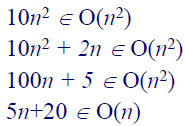

* $Ω(g(n))$ ：存在某个正常数和某个非负整数，使得对于所有 $n \geq n_0$ 有 $t(n) \geq c \cdot g(n)$ （高阶或同阶增长）

  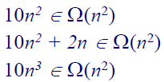

* $Θ(g(n))$ ：存在某两个正常数和某个非负整数，使得对于所有 $n \geq n_0$ 有 $c_2 \cdot g(n) \leq t(n) \leq c_1 \cdot g(n)$ （同阶增长）

  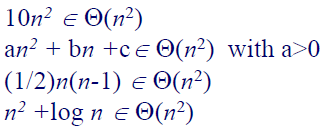

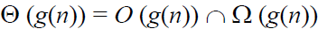

**其他用于比较算法基本运算次数增长顺序的符号**：

* $o(g(n))$ ：存在某个正常数和某个非负整数，使得对于所有 $n \geq n_0$ 有 $t(n)<c \cdot g(n)$
* $omega(g(n))$ ：存在某个正常数和某个非负整数，使得对于所有 $n \geq n_0$ 有 $t(n)>c \cdot g(n)$

**渐近增长阶数特性（也适用于 $Ω$ 符号和 $Θ$ 符号）**：

* 反身性： $f(n)∈O(f(n))$
* 传递性： $f(n)∈O(g(n)), g(n)∈O(h(n)) ⇒ f(n)∈O(h(n))$
* 互对称性： $f(n)∈O(g(n)) ⇔ g(n)∈Ω(f(n))$
* 对称性： $f(n)∈Θ(g(n)) ⇔ g(n)∈Θ(f(n))$
* 加法计算： $O(g_1(n))+O(g_2(n))=O(g_1(n)+g_2(n))$
* 乘法计算： $O(g_1(n)) \times O(g_2(n))=O(g_1(n) \times g_2(n))$
* 忽略常数： $O(cf(n))=O(f(n))$

对于由两个连续执行的部分组成的算法，算法的整体效率将由增长阶数较大的部分决定。

$$
\lim_{n \to \infty} \frac{T(n)}{g(n)} = 
\begin{cases} 
0, & T(n) \text{的增长阶数} < g(n) \text{的增长阶数（} O \text{符号）} \\
c > 0, & T(n) \text{的增长阶数} = g(n) \text{的增长阶数（} Θ、O、Ω\text{符号）} \\
\infty, & T(n) \text{的增长阶数} > g(n) \text{的增长阶数（} Ω \text{符号）}
\end{cases}
$$

$$
1 < \log n < n < n \log n < n^2 < n^3 < 2^n < 3^n < n! < n^n
$$

**算法的数学分析步骤**：

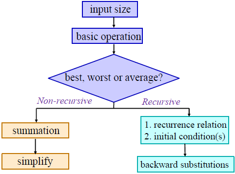

**非递归算法的数学分析步骤**：

* 确定表示输入大小的参数 $n$
* 确定算法的基本操作
* 检查基本操作的执行次数是否只取决于输入值 $n$ 。如果还取决于输入类型，则分别研究最差、平均和最佳情况下的效率
* 为 $C(n)$ 设置求和，反映算法基本操作的执行次数
* 使用标准公式简化求和，找出封闭式公式，或至少找出其增长顺序

**相关算法**：

* 最大元素问题
* 元素唯一性问题
* 矩阵乘法问题
* 计算二进制数位数问题

**递归算法的数学分析步骤**：

* 确定表示输入大小的参数 $n$
* 确定算法的基本操作
* 检查基本操作的执行次数是否会因相同大小的不同输入而变化，如果会则分别研究最差、平均和最佳情况下的效率
* 为 $C(n)$ 设置递推关系和初始条件，即对大小为 $n$ 的输入执行基本操作的次数（也可计算递推调用次数）
* 通过反向替换法或其他方法解决递推问题或估计解的增长顺序

**相关算法**：

* 递归方式计算阶乘问题
  * 递归条件： $M(n)=M(n-1)+1$
  * 初始条件： $M(0)=0$
  * 反向替换法： $M(n)=n$
* 汉诺塔问题
  * 递归条件： $M(n)=2M(n-1)+1$
  * 初始条件： $M(1)=1$
  * 反向替换法： $M(n)=2^n-1$
* 计算二进制数位数问题
  * 递归条件： $M(n)=M(\lfloor n/2 \rfloor)+1$
  * 初始条件： $M(1)=0$
  * 反向替换法： $M(2^k)=k ⇒ M(n)= \log _2n$
* 斐波那契数列问题
  * 递归条件： $F(n)=F(n-1)+F(n-2)$
  * 初始条件： $F(0)=0$，$F(1)=1$
* 斐波那契螺旋问题

  

* 兔子问题
  * 递归条件： $F(n)=F(n-1)+F(n-2)$
  * 初始条件： $F(0)=1$，$F(1)=1$
* 树枝生长问题（鲁德维格定律）
  一株树苗在一段间隔，例如一年，以后长出一条新枝；第二年新枝“休息”，老枝依旧萌发；此后，老枝与“休息”过一年的枝同时萌发，当年生的新枝则次年“休息”。这样，一株树木各个年份的枝桠数，便构成斐波那契数列。

  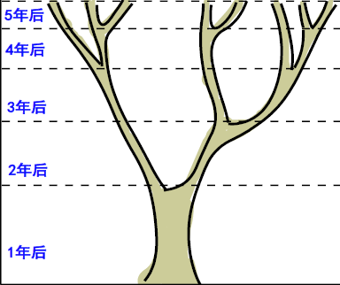

* 上楼梯问题

  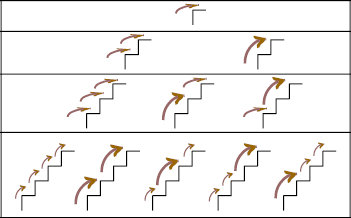

* 蜜蜂进蜂房问题

  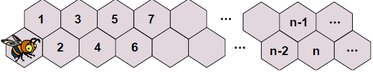

## 03 蛮力法

**相关算法**：

* 计算 $a^n$
* 计算 $n!$
* 连续整数检测算法
* 查找算法
* 矩阵相乘算法

**排序问题**：

* 选择排序
  * 基本操作：比较
  * 比较次数： $n(n-1)/2$
  * 交换次数： $n-1$
  * 该算法不需要考虑最差、平均和最优效率
* 冒泡排序
  * 基本操作：比较
  * 比较次数： $n(n-1)/2$
  * 交换次数： $n(n-1)/2$
  * 对于所有规模为 $n$ 的数组，该算法的键值比较次数相同
  * 最坏的情况是遇到一个降序排列的数组，此时键比较和键交换的次数相同
  * 如果列表中没有交换，则说明列表已经排序，我们可以停止算法

**查找问题**：

* 顺序查找
* 字符串匹配

**蛮力法解决组合问题的步骤**：

* 列出所有解决方案
* 选择满足条件的解决方案
* 逐一评估，排除不可行的解决方案，跟踪找到的最佳解决方案
* 找到的理想解决方案

通过图中所有顶点一次且仅一次的通路称为哈密顿通路。通过图中所有顶点一次且仅一次的回路称为哈密顿回路。具有哈密顿回路的图称为哈密顿图。

**相关算法**：

* 旅行商问题（TSP）：找到最短的哈密顿回路
  * 排列数量： $(n-1)!$
* 背包问题
  * 排列数量： $2^n$
* 任务分配问题
  * 排列数量： $n!$

**NP 难问题**：没有已知的多项式时间解法。
  * 旅行商问题（TSP）
  * 背包问题
  * 任务分配问题

**深度优先搜索（DFS）**：

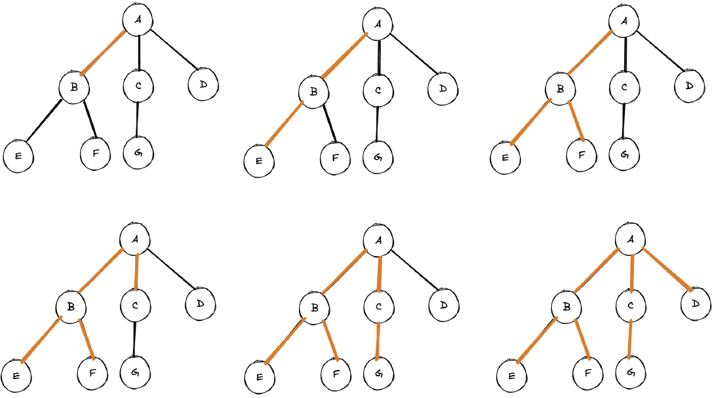

**广度优先搜索（BFS）**：

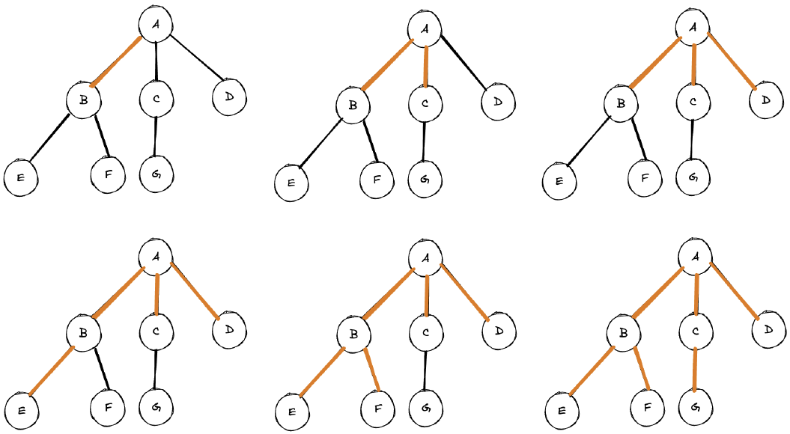

## 04 递归法

**递归法**：递归的边界条件和递归方程是递归的两个要点。

递归的简单形式汇掩盖递归的非高效性。

**相关算法**：

* 递归方式计算阶乘

  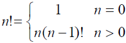

* 递归方式计算斐波那契数列

  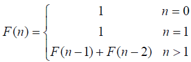

  斐波那契数列的一个封闭形式解（Binet 公式）：

  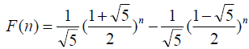

  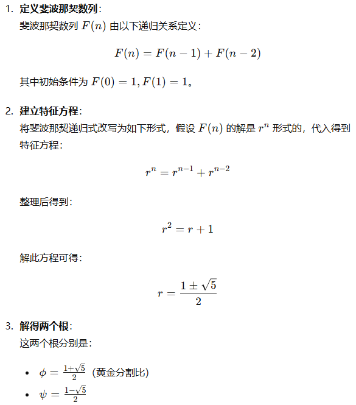

  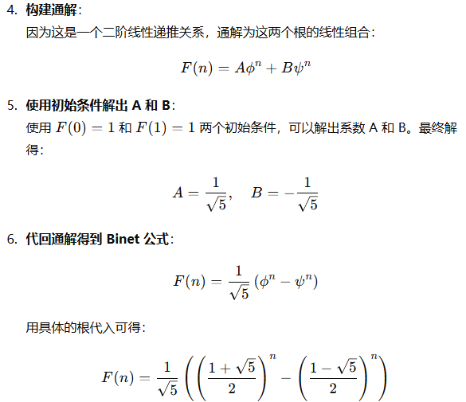

* 阿克曼（Ackerman）函数
  * $A(n,0)=n+2$
  * $A(n,1)=2n$
  * $A(n,2)=2^n$

  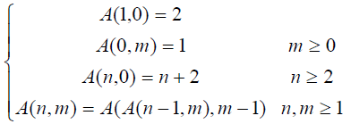

* 汉诺塔问题
* 排列问题：先固定第一个元素，求剩下的全排列，求剩下的全排列时，固定剩余元素中的第一个元素，再求剩下元素的全排列，直到就剩一个元素停止
  * 复杂度： $n!$

  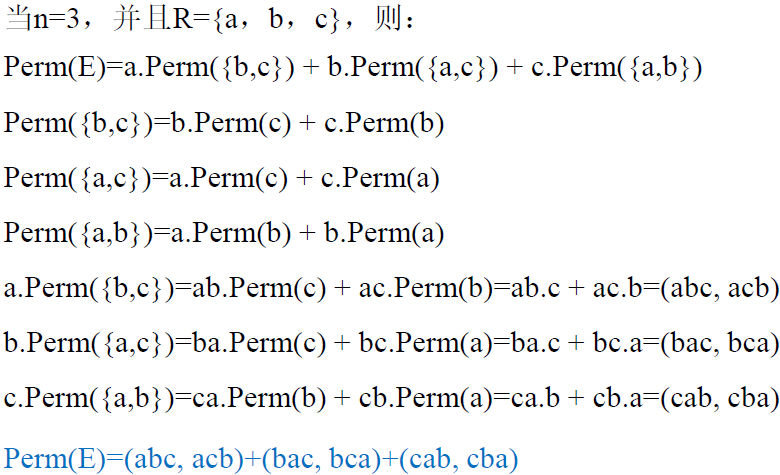

## 05 减治法

**减治法**：自顶向下（递归）与自底向上（迭代）

**减治法的三种变体**：

* 减常量

  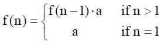

* 减常因子

  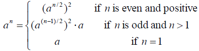

  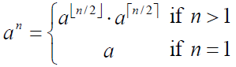

* 减可变规模

  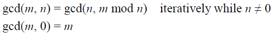

**减一算法**：

* 插入排序：

  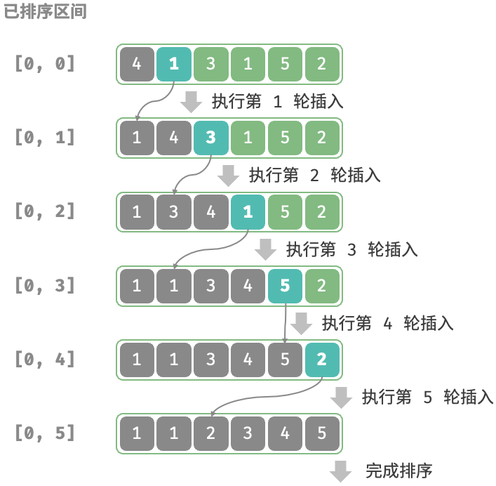

  * 基本操作：比较
  * 最差情况： $n(n-1)/2$
  * 最佳情况： $n-1$
  * 平均情况： $≈n^2/4$

  在使用快速排序时，当子数组小于某个值之后，就可以改用插入排序。

* 拓扑排序：有向无环图（DAG）是拓扑排序的充分必要条件

  * 先修课程问题
    * 深度优先查找（DFS）
      * DFS 遍历注意顶点从堆栈中弹出的顺序
      * 颠倒上述顺序
      * DFS 遍历顺序与拓扑排序顺序相反
      * 复杂度分析：$O(E+V)$ （邻接链表）
    * 基于减治技术（Source Removal Method）
      * 复杂度分析：$O(E+V)$ （邻接链表）

      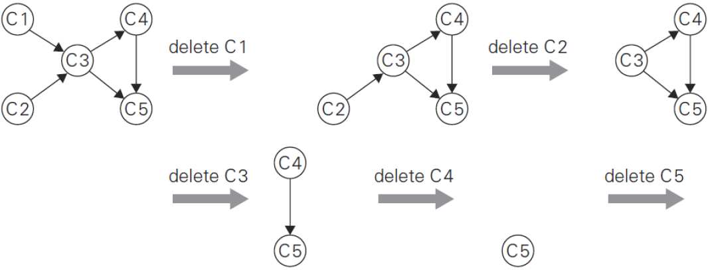

  * 生物链问题
  * 程序编译中的指令调度问题
  * 电子表格单元格的公式求值顺序问题
  * 链接器中的符号依赖问题

**减一算法时间效率分析**：

递推方程的一般形式： $T(n)=T(n-1)+f(n)$

$f(n)$ 表示把一个实例化简为一个更小的实例并把更小实例的解拓展为更大实例的解所需要的时间。

使用反向替换法求解，得到：

$$
T(n) = T(0) + \sum_{j=1}^{n} f(j)
$$

**减常因子算法**：

* 二分搜索
  * 最差情况： $\log _2n+1$
  * 最佳情况： $1$
  * 平均情况： $\log _2(n+1)-1$
* 假硬币问题
  * 二分方式
    * 递归条件： $W(n)=W(\lfloor n/2 \rfloor)+1$
    * 初始条件： $W(1)=0$
    * 时间复杂度： $W(n)=O(\log _2n)$
  * 三分方式
    * 递归条件： $W(n)=W(\lfloor n/3 \rfloor)+1$
    * 初始条件： $W(1)=0$
    * 时间复杂度： $W(n)=O(\log _3n)$
* 俄氏乘法

  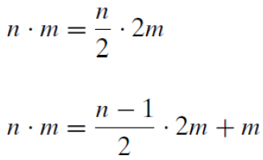

  使用俄氏乘法计算 $50 \times 65$ ：

  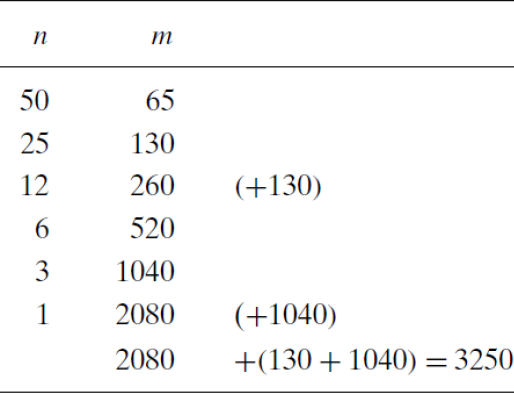

**减常因子算法时间效率分析**：

递推方程的一般形式： $T(n)=T(n/b)+f(n)$ （ $b>1$ ）

$f(n)$ 表示把一个实例化简为一个更小的实例并把更小实例的解拓展为更大实例的解所需要的时间。

基于平滑法则，使用反向替换法求解，得到：

$$
T(b^k) = T(1) + \sum_{j=1}^{k} f(b^j)
$$

## 文档更新日期

2024年6月23日